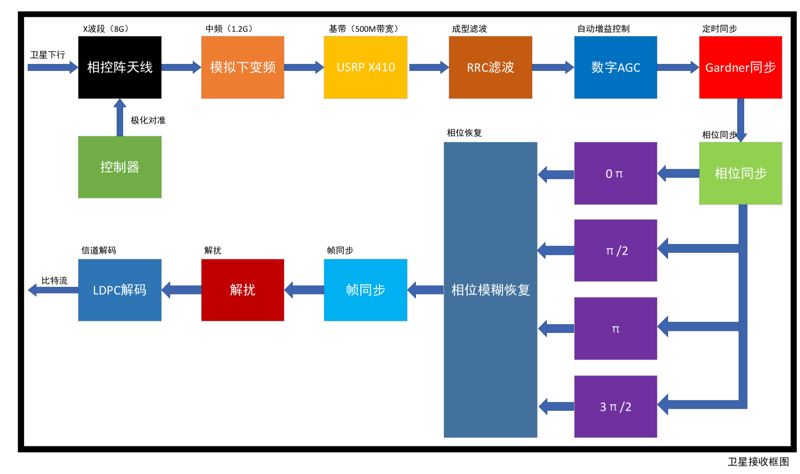

# 卫星QPSK接收机教学案例 - 基于真实卫星数据的开放式多技术路径实现


## 🎯 项目简介

本项目是北京邮电大学"通信系统建模与仿真"课程的**创新教学案例**，基于北邮70周年校庆期间接收的**真实SAR卫星下行数据**，设计实现了完整的QPSK数字接收机系统。项目提供了**MATLAB实时教程**（Comprehensive_Satellite_QPSK_Tutorial.m），采用**模块化渐进式教学**，通过9个章节深度解析QPSK接收机的每个核心模块，从信号加载到最终解扰输出的完整实现链路。

### ✨ 核心特色

- 🛰️ **真实工程数据**：使用53.7GB真实SAR卫星中频IQ数据，体验工程级信号处理挑战
- 🔗 **完整链路**：从信号预处理到数据恢复的端到端QPSK接收机实现
- 📚 **MATLAB实时教程**：9章渐进式教学，从理论到实践的完整覆盖，每章包含详细代码实现
- 🎯 **模块化设计**：5大核心模块（数据加载、RRC滤波、定时同步、载波同步、帧同步解扰）
- 🏆 **实践验证**：经过多位学生的实际项目验证，教学效果显著

## 📖 项目背景

本项目源于一个为庆祝**北京邮电大学建校70周年**而特别设计的工程实践活动。为了将专业教学与校庆纪念深度融合，"通信系统建模与仿真"课程团队与**株洲太空星际公司**合作，策划并实施了一次富有创新和纪念意义的卫星遥感实验。

活动当天，学生志愿者们在北京邮电大学西土城校区的操场上，利用角反射面精心布置出醒目的"70"字样。与此同时，株洲太空星际公司调动其在轨的SAR（合成孔径雷达）遥感卫星，精确对准该区域进行成像，并通过高速下行链路将原始回波数据实时传回地面。

本教学案例所使用的 **53.7GB真实数据集**，正是这次宝贵实验的直接产出。它不仅记录了从太空视角看北邮的独特印记，更承载了从原始射频信号到最终解调出有效信息的完整技术链路。通过对这份数据的分析与处理，学生得以亲身体验真实卫星通信的全过程，将课堂理论应用于解决复杂的工程挑战。

## 📡 技术背景

### 📡 接收设备

本案例中的真实数据由一套专业的地面站设备完成接收，其核心组成如下：
- **遥感卫星**：所使用的遥感卫星为株洲太空星际公司自主研发的一颗低轨 SAR 成像卫星。实验当日，卫星对
校区进行 1 分钟左右的连续成像，并通过 X 波段下行链路将数据实时回传至地面。
- **天线系统**：采用了高增益的**相控阵天线**，能够自动跟踪卫星轨迹，确保在卫星过境期间稳定接收X波段下行信号。
- **软件定义无线电（SDR）**：使用 **NI Ettus USRP X410** 作为核心的软件无线电接收设备。它负责对模拟下变频至1.2GHz的中频信号进行录制和接收，并保存为int16格式的复包络形式的数字基带信号，为后续的纯软件解调提供高质量的原始信号。信号接收部分主要由航天宏图技术人员及课程指导老师负责，采用相控阵天线，基于Ubuntu系统进行实时接收。学生的任务是对接收到的数字复包络信号进行信号处理。

### 📊 关键技术指标
- **卫星成像使用频段**：9300-9900MHz
- **卫星数据下传频段**：8025-8400MHz
- **SDR中频**：1200MHz
- **调制方式**：QPSK（四相相移键控）
- **数据传输速率**：150 Mbps数传左旋，对应符号率75 MBaud/s
- **采样率**：500 MHz
- **滚降系数**：α = 0.33（工程优化值）
- **帧结构**：CCSDS AOS标准，1024字节/帧
- **同步字**：0x1ACFFC1D（32比特，优秀自相关特性）
- **数据文件**：53.7GB真实SAR卫星IQ数据

## 📁 项目结构

```
SatelliteQPSK/
├── 📄 README.md                        # 项目说明文档
├── 📄 LICENSE                          # 开源协议
├── 📂 docs/                            # 📚 完整文档体系
│   ├── 📖 Comprehensive_Satellite_QPSK_Tutorial.m  # 🆕 MATLAB实时教程（9章完整实现）
│   ├── 📖 TUTORIAL.md                  # 详细教程
│   ├── 📝 基于真实卫星数据的QPSK接收机教学案例设计与实现（初稿）.md
│   ├── 📋 卫星数传信号帧格式说明.pdf    # CCSDS AOS标准文档
│   └── 📚 [8个参考文献PDF]              # 技术参考资料
├── 📂 references/                      # 🔬 学术参考文献
│   ├── 📄 SDR相关论文集.pdf
│   ├── 📄 DVB-S2技术标准.pdf
│   └── 📄 [其他6个参考文献]
├── 📂 student_cases/                   # 🎓 学生实现案例集
│   └── 📂 14+2022210532+chengzirui/    # 🔵 程梓睿：纯MATLAB实现
│       ├── 🎯 SatelliteQPSKReceiverTest.m        # 主测试脚本
│       ├── 📂 lib/                              # 24个核心算法模块
│       │   ├── 🔧 SatelliteQPSKReceiver.m       # 主处理函数
│       │   ├── ⏱️ GardnerSymbolSync.m           # Gardner定时同步
│       │   ├── 📡 QPSKFrequencyCorrectPLL.m     # PLL载波同步
│       │   ├── 🎯 FrameSync.m                   # 帧同步算法
│       │   ├── 🔓 FrameScramblingModule.m       # 解扰模块
│       │   ├── 🔍 AOSFrameHeaderDecoder.m       # AOS帧头解析
│       │   └── 🧩 [18+其他核心模块]
│       ├── 📂 out/                              # 输出结果目录
│       └── 📊 技术报告.pdf                      # 详细技术文档
└── 📂 data/                            # 🗄️ 数据文件目录
    ├── 💾 sample_0611_500MHz_middle.bin # 真实SAR卫星数据文件（53.7GB，未直接提供，需自行网盘下载）
    └── 💾 small_sample_256k.bin         # 小段测试数据（256K点，用于快速验证）
```

## 🗄️ 数据管理

### 🛰️ 真实SAR卫星数据集

本项目使用的是北京邮电大学70周年校庆期间接收的真实SAR卫星下行数据，共53.7GB数据文件，分为12卷分卷解压：

**🔗 百度网盘下载链接：**
- **链接**：https://pan.baidu.com/s/1EZNwXBJPChvZMmNumear2g?pwd=j6wr
- **提取码**：j6wr

**📋 数据文件列表：**
- `sample_0611_500MHz_中段.zip` 及其他11个数据文件
- 总计约53.7GB真实卫星IQ数据
- 格式：int16复数数据，采样率500MHz

**💡 使用说明：**
1. 下载所需的数据文件到本地
2. 将数据文件放置在项目的 `data/` 目录下
3. 根据选择的技术路径，在相应的主程序中修改数据文件路径
4. 建议先使用默认提供的较小的数据段进行验证测试

### 🧪 测试数据说明

为了方便快速验证和调试，项目提供了一个小段测试数据文件，经验证，该文件能读出三个帧定位字节，包括两个完整帧。

#### 📁 测试数据文件
- **文件名**：`small_sample_256k.bin`
- **大小**：1MB (1,024,000 bytes)
- **数据点数**：256,000个复数点
- **数据来源**：从`sample_0611_500MHz_middle.bin`中提取的前256K个数据点
- **数据格式**：int16格式的复数IQ数据（实部和虚部交替存储）

#### 🎯 使用场景
- 快速验证算法正确性
- 调试参数设置
- 测试代码功能
- 减少处理时间，提高开发效率

## ⚙️ 环境要求

- **MATLAB**：R2021a或更高版本（推荐R2023a+）
- **必需工具箱**：
  - Signal Processing Toolbox
  - Communications Toolbox
- **硬件要求**：
  - 内存：8GB+（推荐16GB+，用于处理大数据文件）
  - 存储：若要存储全部数据，至少100GB可用空间；若仅验证测试数据，仅需10GB空间
  - CPU：多核处理器（向量化计算优化）

## 🔧 技术路径



### 🆕 路径一：MATLAB实时教程（推荐新手）
- **技术特点**：9章渐进式教学，理论与实践深度结合
- **适合对象**：希望系统学习QPSK接收机原理的学生
- **教程内容**：
  - 📖 **第1-4章**：理论基础与环境准备
  - 📖 **第5.1章**：数据加载与重采样（信号预处理）
  - 📖 **第5.2章**：RRC匹配滤波与AGC（信号整形）
  - 📖 **第5.3章**：Gardner定时同步（符号恢复）
  - 📖 **第5.4章**：PLL载波同步（相位锁定）
  - 📖 **第5.5章**：帧同步与解扰（数据恢复）
  - 📖 **第6章**：帧头验证与性能分析
  - 📖 **第7-9章**：实践指南与扩展学习
- **核心优势**：
  - ✅ 每章包含理论分析、代码实现、可视化展示
  - ✅ 模块化设计，支持分步骤执行和调试
  - ✅ 丰富的图表分析，直观理解算法原理
  - ✅ 基于真实数据，工程级实践体验
- **教程文件**：`docs/Comprehensive_Satellite_QPSK_Tutorial.m`

### 🔵 路径二：纯MATLAB编程实现（程梓睿方案）
- **技术特点**：深入算法原理，24个模块化函数实现
- **适合对象**：希望深度理解算法细节的学生
- **核心创新**：
  - ✅ 3阶Farrow立方插值器优化定时精度
  - ✅ 智能解扰验证与IQ路自动交换
  - ✅ 完整帧处理支持，保留同步字和冗余数据
- **技术亮点**：24个独立功能模块，算法参数可精确控制
- **实现目录**：`student_cases/14+2022210532+chengzirui/`

## 🚀 快速开始

### 🔵 路径一运行步骤
```matlab
% 1. 设置算法库路径
addpath('student_cases/14+2022210532+chengzirui/lib');

% 2. 配置数据文件（必须为int16格式）
% 编辑 SatelliteQPSKReceiverTest.m 第3行，将文件名改为你的测试数据路径
% 例如：filename = 'data/sample_0611_500MHz_middle.bin';
% 快速测试可使用：filename = 'data/small_sample_256k.bin';

% 3. 运行主程序
run('student_cases/14+2022210532+chengzirui/SatelliteQPSKReceiverTest.m');

% 4. 查看输出结果
% - out/IQbytes.txt: IQ字节数据
% - out/unscrambled_hex.txt: 解扰后的十六进制数据
% - out/Ibytes.txt, Qbytes.txt: I/Q路分离数据
```

## 🎓 教学价值

### 🎯 学习目标
- **理论掌握**：深入理解QPSK调制解调、同步算法、信道编码等核心理论
- **系统思维**：掌握数字接收机的系统架构和模块间协调设计
- **工程实践**：获得处理真实工程数据的宝贵经验
- **问题解决**：培养分析和解决同步失锁、参数失配等工程问题的能力
- **渐进学习**：通过9章教程循序渐进掌握完整接收机实现

### 📚 适用课程
- **通信系统建模与仿真**（主要课程）
- **通信原理**（QPSK调制解调实践）
- **数字信号处理**（滤波器设计、同步算法）
- **卫星通信**（AOS帧结构、解扰算法）
- **MATLAB程序设计**（高级编程实践）

### 🏆 教学成果
基于学生程梓睿的实际验证结果：

| 学生案例 | 技术路径 | 主要收获 | 创新亮点 |
|---------|---------|---------|---------|
| 程梓睿 | 纯MATLAB实现 | 算法原理深度理解 | Farrow插值器优化 |

### 📖 MATLAB实时教程特色
- **模块化学习**：9章内容独立设计，支持分步学习
- **理论实践结合**：每章包含详细理论分析和MATLAB实现
- **可视化教学**：丰富的图表帮助理解算法工作原理
- **渐进式调试**：支持按章节执行，便于调试和理解
- **工程级实践**：基于真实卫星数据，体验完整通信链路

## ✅ 验证结果

### 📊 系统性能指标
成功解析AOS帧头信息，验证接收机功能正确性：
```
--- AOS Frame Header Decoded ---
Version: 1
Spacecraft ID: 40 (0x28)
Virtual Channel ID: 0
Frame Count: 514313
--------------------------------
Frame Count: 514314 (连续递增✅)
Frame Count: 514315 (连续递增✅)
```

### 🎯 关键验证点
- ✅ **星座图收敛**：清晰的四象限QPSK星座点
- ✅ **帧同步成功**：准确定位0x1ACFFC1D同步字
- ✅ **解扰正确**：AOS帧头字段解析正确
- ✅ **帧计数连续**：无丢帧现象，系统工作稳定

## 📖 技术支持

### 📚 详细文档
- **[MATLAB实时教程](docs/Comprehensive_Satellite_QPSK_Tutorial.m)** - 🆕 9章渐进式教学，理论与实践深度结合
- **[学术论文](docs/基于真实卫星数据的QPSK接收机教学案例设计与实现（初稿）.md)** - 教学案例设计理念与验证分析

### 🔧 问题排查
- **环境配置**：确保MATLAB版本和工具箱满足要求
- **内存不足**：处理大数据文件时适当调整数据段长度
- **路径问题**：检查数据文件路径和lib目录添加
- **参数调试**：参考各路径的技术报告进行参数优化

### 💡 常见问题解答
1. **Q**: 数据文件太大，如何处理？
   **A**: 可以调整`bitsLength`参数，先处理小段数据进行验证

2. **Q**: 星座图不收敛怎么办？
   **A**: 检查采样率、符号率配置，调整环路带宽参数

3. **Q**: 如何验证解调结果正确性？
   **A**: 使用AOS帧头解析器检查帧计数器连续性

## 🏆 致谢

### 👨‍🎓 学生贡献
- **程梓睿**：纯MATLAB路径，Farrow插值器优化创新

## 📄 开源协议

本项目采用教育用途开源协议，欢迎：
- ✅ 教学使用和课程集成
- ✅ 学术研究和技术交流
- ✅ 非商业用途的修改和分发
- ⚠️ 商业用途请联系项目维护者

## 🌟 项目亮点

- 📊 **实践验证**：多位学生成功实现，教学效果显著
- 🛰️ **真实数据**：53.7GB SAR卫星数据，工程级挑战
- 📚 **文档完善**：教程+学术论文+技术报告的完整体系
- 🔧 **技术先进**：Farrow插值器等创新实现

---
**📧 联系方式**  
**北京邮电大学 信息与通信工程学院**  
**通信系统建模与仿真课程团队**