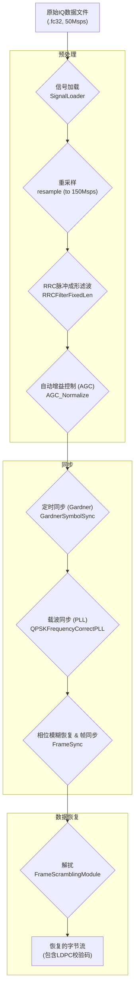

# 卫星QPSK接收机MATLAB实现深度解析教程

**版本: 2.0 (深度扩充版)**

---

## 1. 项目简介与理论背景

### 1.1 项目概述

本项目旨在使用MATLAB从零开始构建一个功能完备的QPSK（四相相移键控）信号接收机。该接收机能够处理一个真实的、从文件中加载的卫星中频IQ（同相/正交）数据流，通过一系列精密的数字信号处理步骤——包括匹配滤波、定时恢复、载波恢复、帧同步和解扰——最终准确地恢复出原始传输的二进制数据。

这不仅仅是一个代码复现练习，更是一次深入探索数字通信物理层核心技术的旅程。通过本教程，您将能够：

*   **理解理论：** 将通信原理中的抽象概念（如RRC滤波器、Gardner算法、锁相环）与实际的MATLAB代码对应起来。
*   **掌握实践：** 亲手操作、调试并观察信号在接收机中每一步的变化，建立直观而深刻的认识。
*   **获得能力：** 具备分析、设计和实现基本数字接收机模块的能力，为更复杂的通信系统设计打下坚实基础。

### 1.2 QPSK在卫星通信中的重要性

QPSK是一种高效的数字调制技术，它在每个符号（Symbol）中编码2个比特（bits）的信息。相比于BPSK（每个符号1比特），QPSK在不增加带宽的情况下将数据传输速率提高了一倍，这使其在频谱资源受限的卫星通信中极具吸引力。

同时，QPSK信号具有恒定的包络（在理想滤波后），这对卫星转发器上的功率放大器（HPA）非常友好，可以使其工作在效率最高的饱和区附近，而不会引入过多的非线性失真。这种功率效率和频谱效率之间的良好平衡，使QPSK成为众多卫星通信标准（如DVB-S, CCSDS）中的首选调制方式之一。

### 1.3 CCSDS标准与本项目关联

本项目处理的信号帧结构遵循 **CCSDS (空间数据系统咨询委员会)** 的AOS (Advanced Orbiting Systems) 建议标准。具体来说：

*   **帧同步字:** 帧同步模块使用了 **`1ACFFC1D`** (十六进制) 作为同步字。这个特定的32比特序列经过精心设计，具有非常优秀的自相关特性——即只有在完全对齐时，其相关峰值才最高，而在其他任何偏移位置，其相关值都非常低。这使得接收机能够在充满噪声的信号流中以极高的概率准确地找到数据帧的起始边界。
*   **AOS帧结构:** 根据《卫星数传信号帧格式说明.pdf》，每个数据帧的总长度为 **1024字节**，由以下部分组成：
    *   **同步字 (ASM):** 4字节 (`0x1ACFFC1D`)
    *   **AOS帧头:** 6字节
    *   **数据负载:** 886字节
    *   **LDPC校验码:** 128字节

理解此帧结构是正确解析数据的关键。

---

## 2. 系统架构与处理流程

本QPSK接收机的处理流程是模块化的，每个模块负责一个特定的信号处理任务。主脚本 [`SatelliteQPSKReceiverTest.m`](SatelliteQPSKReceiverTest.m:1) 负责配置全局参数，并调用核心处理函数 [`lib/SatelliteQPSKReceiver.m`](lib/SatelliteQPSKReceiver.m:1)。其内部处理流程如下图所示，并将在后续章节中进行深度解析。



**各模块核心功能简介:**

1.  **信号加载:** 从二进制文件中读取原始IQ样本。
2.  **重采样:** 将原始50Msps的采样率提升至150Msps，以满足后续处理（如Gardner算法要求sps>=2）的需求。
3.  **RRC滤波:** 作为匹配滤波器，最大化信噪比，并消除码间串扰（ISI）。
4.  **AGC:** 自动调整信号幅度，为后续模块提供稳定的输入电平。
5.  **定时同步:** (Gardner) 找到每个符号波形的“最佳”采样时刻。
6.  **载波同步:** (PLL) 校正频率与相位偏差，锁定星座图。
7.  **相位模糊恢复 & 帧同步:** 由于QPSK的相位对称性，PLL锁定后可能存在0, 90, 180, 270度的相位模糊。此模块通过穷举四种相位并与已知的`1ACFFC1D`同步字进行相关匹配，在确定正确相位的同时，定位数据帧的起始边界。
8.  **解扰:** 根据CCSDS标准，使用`1+X^14+X^15`多项式，对已同步的帧数据进行解扰，恢复出经LDPC编码后的原始数据。
9.  **数据输出:** 将恢复的比特流转换为字节，并写入文件。此时的数据包含AOS帧头、数据负载和LDPC校验位。

---

## 3. 环境准备与文件说明

在开始复现之前，请确保您的环境配置正确，并理解项目中各个关键文件的作用。

### 3.1 环境设置

1.  **MATLAB环境:** 推荐使用 R2016b 或更高版本，以确保所有函数（特别是信号处理工具箱中的函数）都可用。
2.  **项目文件:** 下载或克隆整个项目到您的本地工作目录（例如 `D:\matlab\SatelliteQPSK`）。
3.  **数据文件:** 获取名为 `XESA_Data_1200MHz_B50M_20250308_01.fc32` 的数据文件，并将其放置在项目根目录下。这是一个32位浮点复数格式的文件，其中I和Q分量交错存储。
4.  **MATLAB路径:** 打开MATLAB，并将当前目录切换到您解压的项目根目录。同时，将 `lib` 目录添加到MATLAB的搜索路径中，或在主脚本中通过 `addpath('lib')` 添加。

### 3.2 关键文件解析

*   [`SatelliteQPSKReceiverTest.m`](SatelliteQPSKReceiverTest.m:1): **主测试脚本**。这是您需要运行的入口文件。它定义了所有的配置参数（如文件名、采样率、符号率等），调用核心接收机函数，并负责绘制最终的调试图窗。
*   [`lib/SatelliteQPSKReceiver.m`](lib/SatelliteQPSKReceiver.m:1): **核心接收机封装器**。该函数按照第2节描述的流程，依次调用各个信号处理模块，实现了完整的接收链路。
*   `lib/`: **核心函数库目录**。存放了所有独立的信号处理模块，例如：
    *   [`lib/SignalLoader.m`](lib/SignalLoader.m:1): 数据加载模块。
    *   [`lib/RRCFilterFixedLen.m`](lib/RRCFilterFixedLen.m:1): RRC滤波器。
    *   [`lib/GardnerSymbolSync.m`](lib/GardnerSymbolSync.m:1): Gardner定时同步算法。
    *   [`lib/QPSKFrequencyCorrectPLL.m`](lib/QPSKFrequencyCorrectPLL.m:1): 载波同步锁相环。
    *   [`lib/FrameSync.m`](lib/FrameSync.m:1): 帧同步模块。
    *   ...等等。
*   [`Ibytes.txt`](Ibytes.txt:1) / [`Qbytes.txt`](Qbytes.txt:1): **输出文件**。接收机成功运行后，恢复出的I路和Q路数据将以字节流的形式分别保存在这两个文本文件中。

---

## 4. 核心模块详解与复现 (深度分析)

本章节是教程的核心。我们将逐一深入每个关键模块，剖析其背后的理论、参数选择、代码实现，并指导您如何通过调试观察其效果。

### **预备步骤：开始调试**

1.  打开主脚本 [`SatelliteQPSKReceiverTest.m`](SatelliteQPSKReceiverTest.m:1)。
2.  熟悉 `config` 结构体中的各项参数，特别是 `startBits` 和 `bitsLength`，它们决定了从数据文件的哪个位置开始处理，以及处理多长的数据段。
3.  在 [`lib/SatelliteQPSKReceiver.m`](lib/SatelliteQPSKReceiver.m:1) 的 **第32行** (`s_qpsk = SignalLoader(...)`) 设置一个断点。
4.  返回主脚本，按 `F5` 键开始调试。程序将执行到该断点处暂停。

---

### 4.1 模块详解: RRC匹配滤波

**预期效果:** 信号通过RRC滤波器后，频谱被有效抑制在符号速率范围内，眼图张开，为后续的定时同步做好了准备。

#### **理论深度**

在数字通信系统中，为了限制信号带宽并消除码间串扰（ISI），发送端通常使用一个**脉冲成形滤波器**。最常用的就是**升余弦（Raised Cosine, RC）**或其平方根——**根升余弦（Root Raised Cosine, RRC）**滤波器。

奈奎斯特第一准则指出，如果一个滤波器的冲激响应在符号间隔的整数倍时刻上除了中心点外都为零，那么它就不会引入ISI。RC滤波器满足此准则。

为了在发射机和接收机之间优化信噪比，通常采用**匹配滤波器**方案：即发射机和接收机各使用一个RRC滤波器。两个级联的RRC滤波器等效于一个RC滤波器，既满足了无ISI准则，又实现了最佳的信噪比性能。

RRC滤波器的冲激响应 `h(t)` 的数学表达式为：

$$
h(t) = \frac{4\alpha}{\pi\sqrt{T_s}} \frac{\cos((1+\alpha)\frac{\pi t}{T_s}) + \frac{\sin((1-\alpha)\frac{\pi t}{T_s})}{4\alpha t/T_s}}{1 - (4\alpha t/T_s)^2}
$$

其中：
*   $T_s$ 是符号周期 ($1/f_{sym}$)。
*   $\alpha$ 是**滚降系数 (Roll-off factor)**。

#### **参数选择: 滚降系数 `alpha`**

`alpha` 是RRC滤波器最重要的参数，其取值范围为 `[0, 1]`。

*   **基本概念澄清:**
    *   **比特率 (Bit Rate, $f_{bit}$):** 每秒传输的比特数。本项目为 **75 Mbps**。
    *   **符号率 (Symbol Rate / Baud Rate, $f_{sym}$):** 每秒传输的符号数。由于QPSK每个符号承载2个比特，因此符号率为 $f_{sym} = f_{bit} / 2 = \textbf{37.5 MBaud/s}$。
    *   在代码和后续讨论中，`fb` 常常指代符号率。

*   **物理意义**: `alpha` 决定了信号占用的实际带宽。信号带宽 $BW = (1 + \alpha) \cdot f_{sym}$。
*   **取值影响**:
    *   `alpha = 0`: 带宽最窄（等于奈奎斯特带宽 $f_{sym}$），但其冲激响应拖尾很长，对定时误差非常敏感。
    *   `alpha = 1`: 带宽最宽（等于 $2 \cdot f_{sym}$），冲激响应衰减最快，对定时误差最不敏感，但频谱利用率最低。
    *   **在本项目中 (`config.rollOff = 0.35`)**: 这是一个非常典型且工程上常用的折中值。它在保证较低带外泄露的同时，提供了对定时误差较好的鲁棒性。

#### **代码实现与复现**

在 [`lib/RRCFilterFixedLen.m`](lib/RRCFilterFixedLen.m:1) 中，核心是MATLAB的 `rcosdesign` 函数。

```matlab
% lib/RRCFilterFixedLen.m

function y = RRCFilterFixedLen(fb, fs, x, alpha, mode)
    % 参数
    span = 8; % 滤波器长度（单位符号数），即滤波器覆盖8个符号的长度
    sps = floor(fs / fb); % 每符号采样数 (Samples Per Symbol)
        
    % 生成滤波器系数
    % 'sqrt' 模式指定了生成根升余弦(RRC)滤波器
    h = rcosdesign(alpha, span, sps, 'sqrt');
            
    % 卷积，'same' 参数使输出长度与输入长度一致
    y = conv(x, h, 'same');
end
```

**复现与观察:**

1.  在调试模式下，执行到 **第38行** (`s_qpsk = RRCFilterFixedLen(...)`)。
2.  **观察频谱:** 执行完此行后，在命令窗口绘制滤波后信号的功率谱。
    ```matlab
    figure;
    pwelch(s_qpsk, [], [], [], config.fs_resampled, 'centered'); % 注意使用重采样后的fs
    title('RRC滤波后的信号频谱');
    ```
    您应该能看到信号的功率被集中在奈奎斯特带宽 `[-f_sym/2, f_sym/2]` (即 `[-18.75, 18.75]` MHz) 附近，总带宽约为 `(1+alpha)*f_sym`。频谱边缘有平滑的滚降。
3.  **观察星座图:** 此时绘制星座图 `scatterplot(s_qpsk)`，由于未经任何同步，它看起来会是一个非常模糊的、旋转的环形。这是正常的。

---

### 4.2 模块详解: Gardner定时同步

**预期效果:** 经过Gardner同步后，采样点被调整到每个符号的最佳位置。此时的星座图，点会从之前的弥散环状开始向四个目标位置收敛，形成四个模糊的“云团”，但整个星座图可能仍在旋转。

#### **理论深度**

定时同步的目标是克服由于收发双方时钟频率的细微偏差（符号时钟偏移）导致的采样点漂移问题。Gardner算法是一种高效的、不依赖于载波相位的定时误差检测（TED）算法。

它的核心思想是：在每个符号周期内，采集两个样本：一个是在预估的最佳采样点（**判决点, Strobe Point**），另一个是在两个判决点之间的中点（**中点, Midpoint**）。

Gardner定时误差检测器的数学公式为：

$$
e[k] = \text{real}\{y_{mid}[k]\} \cdot (\text{real}\{y_{strobe}[k]\} - \text{real}\{y_{strobe}[k-1]\}) + \text{imag}\{y_{mid}[k]\} \cdot (\text{imag}\{y_{strobe}[k]\} - \text{imag}\{y_{strobe}[k-1]\})
$$

其中 $k$ 是符号索引。

*   **直观解释**:
    *   如果采样点准确，那么判决点应该落在符号波形的峰值，此时 `y_strobe[k]` 和 `y_strobe[k-1]` 的幅度应该相似但符号可能相反。而中点采样 `y_mid[k]` 应该落在过零点附近，其值接近于0。因此，整体误差 `e[k]` 接近于0。
    *   如果采样点超前，`y_mid[k]` 会偏离过零点，导致 `e[k]` 产生一个正值或负值，指示了超前的方向。
    *   如果采样点滞后，`e[k]` 会产生一个符号相反的值。

这个误差信号 `e[k]` 会被送入一个**环路滤波器**（通常是二阶的PI控制器），用于平滑误差并控制一个**内插器**，微调下一次的采样时刻，形成一个闭环控制系统，最终将采样时刻锁定在最佳位置。

#### **参数选择: 环路带宽 `Bn` 和阻尼系数 `zeta`**

在 [`lib/GardnerSymbolSync.m`](lib/GardnerSymbolSync.m:1) 中，环路滤波器的特性由 `B_loop` (归一化环路带宽) 和 `zeta` (阻尼系数) 决定。

*   **环路带宽 `Bn` (或 `B_loop`)**:
    *   **物理意义**: 决定了环路对定时误差的跟踪速度和响应能力。它通常被归一化到符号速率 `f_sym`。带宽越宽，环路锁定速度越快，能跟踪的频率偏差范围也越大。
    *   **取值影响**: 宽带环路虽然响应快，但对噪声更敏感，会导致锁定后的“抖动”（Jitter）更大。窄带环路对噪声抑制更好，锁定更稳定，但锁定速度慢，跟踪范围小。本项目中 `B_loop = 0.0001` 是一个相对较窄的带宽（即 $0.0001 \cdot f_{sym}$），适用于信噪比较好的场景，追求高稳定度。
*   **阻尼系数 `zeta`**:
    *   **物理意义**: 决定了环路响应的瞬态特性，即如何达到稳定状态。
    *   **取值影响**:
        *   `zeta < 1`: 欠阻尼，环路响应快，但会有超调和振荡。
        *   `zeta = 1`: 临界阻尼，最快的无超调响应。
        *   `zeta > 1`: 过阻尼，响应缓慢，无超调。
        *   **本项目中 `zeta = 0.707`**: 这是一个经典的、理论上最优的取值，它在响应速度和稳定性之间提供了最佳的平衡，使得环路有大约4%的超调，但能快速稳定下来。

#### **代码实现与复现**

在 [`lib/GardnerSymbolSync.m`](lib/GardnerSymbolSync.m:1) 中，核心逻辑在 `for` 循环内。

```matlab
% lib/GardnerSymbolSync.m (部分关键代码)

% ... PI控制器系数计算 ...
c1 = (4 * zeta * Wn) / (1 + 2 * zeta * Wn + Wn^2);
c2 = (4 * Wn^2)      / (1 + 2 * zeta * Wn + Wn^2);

% ... 主循环 ...
for m = 6 : length(s_qpsk)-3
    % ... NCO和插值器逻辑，用于产生判决点和中点采样 ...
    
    if isStrobeSample
        % === 当前是判决点 (Strobe Point) ===
        
        % --- Gardner 误差计算 ---
        timeErr = mid_I * (y_I_sample - y_last_I) + mid_Q * (y_Q_sample - y_last_Q);

        % --- 环路滤波器 (PI控制器) ---
        % wFilter是NCO的控制字，timeErr是输入，timeErrLast是状态
        wFilter = wFilterLast + c1 * (timeErr - timeErrLast) + c2 * timeErr;

        % 存储状态用于下次计算
        timeErrLast = timeErr;
        y_last_I = y_I_sample;
        y_last_Q = y_Q_sample;
        
        % ...
    else
        % === 当前是中点 (Midpoint) ===
        mid_I = y_I_sample;
        mid_Q = y_Q_sample;
    end
    % ...
end
```

**复现与观察:**

1.  在调试模式下，执行到 **第44行** (`s_qpsk_sto_sync = GardnerSymbolSync(...)`)。
2.  **观察星座图:** 执行完此行后，在命令窗口绘制星座图。
    ```matlab
    scatterplot(s_qpsk_sto_sync);
    title('定时同步后的星座图');
    ```
    对比RRC滤波后的星座图，您会发现一个显著的变化：之前完全弥散的环状点云，现在开始向四个角落聚集，形成了四个模糊的“云团”。这证明定时恢复已经起作用，采样点已经基本对准。但由于载波频偏未校正，整个星座图可能仍在整体旋转。

---

### 4.3 模块详解: 载波同步 (PLL)

**预期效果:** 经过PLL锁相环后，星座图的旋转被完全“锁住”，四个点簇将清晰、稳定地聚集在 `(1,1)`, `(1,-1)`, `(-1,1)`, `(-1,-1)` 的理想位置附近。这是接收机同步成功的标志性时刻。

#### **理论深度**

载波同步的目标是补偿两类相位失真：
1.  **载波频率偏移 (CFO):** 由发射机和接收机本地振荡器（晶振）的频率不完全一致引起，导致星座图持续旋转。
2.  **载波相位偏移 (CPO):** 由信道延迟等因素引入的一个固定的相位偏移。

本项目采用的是一种**判决辅助的二阶锁相环（PLL）**。这是一个经典的反馈控制系统。

**工作机制:**
1.  **相位误差检测 (Phase Detector):** 对于接收到的每一个符号 `y[n]`，首先对其进行硬判决，得到离它最近的理想星座点 `d[n]`。`y[n]` 和 `d[n]` 之间的相位差，就代表了当前的相位误差。这个误差可以通过一个简单的复数乘法来估计：
    $$
    e[n] \approx \text{imag}\{ y[n] \cdot \text{conj}(d[n]) \}
    $$
    其中 `conj` 是复共轭。当相位差很小时，`angle(z) ≈ imag(z)`。这个公式巧妙地避免了直接计算反正切，计算效率很高。

2.  **环路滤波器 (Loop Filter):** 检测出的瞬时误差 `e[n]` 充满了噪声。环路滤波器（同样是一个PI控制器）对误差进行平滑和积分，以获得对相位误差的稳定估计，并抑制噪声。

3.  **数控振荡器 (NCO):** NCO根据环路滤波器的输出，生成一个校正相位 `theta`。然后，它产生一个复数校正因子 `exp(-j * theta)`。

**闭环工作:** 将下一个输入符号乘以这个校正因子，其相位就被“反向旋转”了。这个 `检测 -> 滤波 -> 校正` 的过程在每个符号上迭代进行，直到相位误差 `e[n]` 趋近于零，此时环路“锁定”，星座图停止旋转。

#### **参数选择: 比例增益 `kp` 和积分增益 `ki`**

在 [`lib/QPSKFrequencyCorrectPLL.m`](lib/QPSKFrequencyCorrectPLL.m:1) 的实现中，`kp` 和 `ki` 是直接作为参数传入的。而在主脚本 [`SatelliteQPSKReceiverTest.m`](SatelliteQPSKReceiverTest.m:1) 中，它们通常根据环路带宽 `Bn` 和阻尼系数 `zeta` 计算得出。`Bn` 被归一化到采样率 `fs`。

一个常用的二阶环路PI控制器系数计算公式为：
$$
k_p = \frac{4 \zeta (B_n/f_s)}{1 + 2\zeta (B_n/f_s) + (B_n/f_s)^2}
$$
$$
k_i = \frac{4 (B_n/f_s)^2}{1 + 2\zeta (B_n/f_s) + (B_n/f_s)^2}
$$

*   **`kp` (比例增益):** 决定了环路对当前瞬时相位误差的响应强度。`kp` 越大，响应越快，但对噪声也越敏感。
*   **`ki` (积分增益):** 决定了环路对累积相位误差的响应强度。`ki` 的作用是消除稳态误差。如果没有积分项，PLL只能跟踪相位偏移（CPO），而无法跟踪频率偏移（CFO）。只有积分器才能将恒定的频率偏移（表现为线性增长的相位）所产生的持续相位误差累加起来，最终输出一个恒定的校正量来抵消它。

**本项目中的取值 (`config.pll_bandWidth=0.02`, `config.pll_dampingFactor=0.707`)**:
*   这里的环路带宽 `Bn` 被设置为 `0.02`，它是一个归一化值，通常相对于采样率。这是一个中等带宽的环路，能够在较短时间内锁定，同时保持较好的噪声抑制性能。

#### **代码实现与复现**

在 [`lib/QPSKFrequencyCorrectPLL.m`](lib/QPSKFrequencyCorrectPLL.m:1) 中，实现了PLL的核心逻辑。

```matlab
% lib/QPSKFrequencyCorrectPLL.m (部分关键代码)

function [y,err] = QPSKFrequencyCorrectPLL(x,fc,fs,ki,kp)
    theta = 0;
    theta_integral = 0;

    for m=1:length(x)
       % 1. 应用上一次计算出的相位进行校正
       x(m) = x(m) * exp(-1j*(theta));
        
       % 2. 判决辅助的相位误差检测
       % 找到最近的理想QPSK星座点 (硬判决)
       desired_point = (sign(real(x(m))) + 1j*sign(imag(x(m)))) / sqrt(2); % 归一化
       
       % 计算相位差 (e ≈ imag(y*conj(d)))
       angleErr = imag(x(m) * conj(desired_point));
       
       % 3. 二阶环路滤波器 (PI控制器)
       % 比例部分: kp * angleErr
       % 积分部分: ki * (theta_integral + angleErr)
       theta_delta = kp * angleErr + ki * (theta_integral + angleErr);
       theta_integral = theta_integral + angleErr; % 累积误差
       
       % 4. NCO: 更新总相位
       theta = theta + theta_delta;
       
       % 输出当前已校正的信号
       y(m) = x(m);
    end
end
```

**复现与观察:**

1.  在调试模式下，执行到 **第47行** (`s_qpsk_cfo_sync = QPSKFrequencyCorrectPLL(...)`)。
2.  **观察星座图 (决定性的一步):** 执行完此行后，在命令窗口绘制星座图。
    ```matlab
    scatterplot(s_qpsk_cfo_sync);
    title('载波同步后的星座图');
    grid on;
    ```
    此时，您应该能看到一个**清晰、稳定**的QPSK星座图。四个点簇分别紧密地聚集在 `(1,1)`, `(1,-1)`, `(-1,1)`, `(-1,-1)` 的位置附近（或其某个 $\pi/2$ 的整数倍相偏位置，这将在后续差分解码中解决）。这标志着接收机的同步过程已圆满成功！

---

### 4.4 模块详解: 相位模糊恢复、帧同步与解扰

载波同步成功后，我们得到了清晰的星座图，但还面临三个紧密相关的问题：相位模糊、帧边界未知和数据加扰。

#### **相位模糊恢复与帧同步**

*   **问题:** QPSK星座图具有 $\pi/2$ 的旋转对称性。PLL环路可能锁定在四个稳定状态中的任意一个，导致恢复的符号存在 0, 90, 180, 或 270 度的固定相位偏差。同时，我们需要在连续的符号流中找到帧的起始位置。
*   **解决方案 (一体化处理):** 这两个问题可以通过一个步骤解决。[`lib/FrameSync.m`](lib/FrameSync.m:1) 采用了一种高效的策略：
    1.  对接收到的符号流，**穷举四种可能的相位校正**（乘以 $e^{j \cdot k \cdot \pi/2}$，其中 k=0,1,2,3）。
    2.  对每一种校正后的结果，进行硬判决得到比特流。
    3.  使用一个“滑窗”，将比特流与本地存储的32位 **CCSDS同步字 `1ACFFC1D`** 进行相关性计算（或直接比较）。
    4.  找到哪个相位校正能够产生最强的相关峰值。这个峰值的位置就是帧的起始点，而对应的相位校正角度就是需要补偿的相位模糊。
*   **结果:** 此步骤完成后，我们不仅校正了相位模糊，还精确地定位了每个1024字节AOS帧的边界。

#### **解扰 (Descrambling)**

*   **目标:** 恢复被加扰的原始数据。根据《卫星数传信号帧格式说明.pdf》，在发射端，数据在LDPC编码后、加入同步字之前，经过了加扰处理。加扰的目的是打破数据中可能存在的长串“0”或“1”，保证信号频谱的均匀性，这有利于接收端各同步环路的稳定工作。
*   **工作机制:**
    1.  **加扰多项式:** 加扰器基于一个本原多项式 **`1 + X^14 + X^15`** 来生成伪随机二进制序列 (PRBS)。
    2.  **不同初相:** I路和Q路的加扰器使用不同的初始状态（初相），以生成两路独立的PRBS。
        *   I路初相: `111111111111111` (二进制)
        *   Q路初相: `000000011111111` (二进制)
    3.  **解扰实现:** 在接收端，[`lib/FrameScramblingModule.m`](lib/FrameScramblingModule.m:1) 会根据同样的配置（多项式和初相）生成一个完全同步的PRBS。将接收到的加扰数据流与本地生成的PRBS再次进行按位异或（XOR）。根据逻辑运算 `(Data XOR PRBS) XOR PRBS = Data`，即可恢复出LDPC编码后的数据。
*   **关键:** 解扰成功的关键在于，接收端的PRBS生成器（LFSR）的配置必须与发射端完全一致，并且其起始状态需要通过帧同步来精确对齐。

**复现与观察:**
1.  执行 **第50行** 和 **第53行**。
2.  观察工作区的变量 `sync_frame`，它的维度 `[rows, columns]` 表示找到了 `rows` 个完整的数据帧。
3.  观察最终的 `I_array` 和 `Q_array`，它们包含了最终恢复的、解扰后的比特信息。

---

## 5. 运行与验证

当程序完整运行结束后，您可以通过以下方式验证接收机的性能。

### 5.1 检查输出文件

*   在您的项目根目录下，检查是否生成了 [`Ibytes.txt`](Ibytes.txt:1) 和 [`Qbytes.txt`](Qbytes.txt:1) 文件。
*   打开这些文件，确认它们包含了非零的数据。这表明整个接收机流程已成功执行，并恢复出了有效数据。

### 5.2 分析调试图窗

程序运行结束后，会弹出多个图窗。请重点关注：

*   **"定时同步星座图"** vs **"载波同步星座图"**: 这是最有价值的对比。它直观地展示了PLL如何将一个旋转的、模糊的星座图“锁定”为一个清晰、稳定的星座图。
*   **频谱图**: 显示了信号经过RRC滤波器后的频谱形态，验证了脉冲成形的效果。

### 5.3 (进阶) 误码率分析

如果您拥有原始的发送数据，或者能够根据某些已知的帧内容（如信标信息）构造出发射序列，您可以使用MATLAB的 `biterr` 函数来计算误码率(BER)。

假设您构造了一个名为 `transmitted_bits` 的已知发送比特序列，对应于接收到的 `received_bits`：

```matlab
% 假设 I_array 是接收到的I路比特矩阵
received_bits = reshape(I_array', 1, []); % 将其转换为行向量

% 假设你知道前N个比特的正确序列
N = length(transmitted_bits);
[number_of_errors, bit_error_rate] = biterr(transmitted_bits, received_bits(1:N));

fprintf('误码数: %d\n', number_of_errors);
fprintf('误码率 (BER): %e\n', bit_error_rate);
```

这是一个衡量通信系统性能的最终指标。

---

## 6. 总结与展望

本项目通过一系列精心设计的MATLAB模块，并配以此深度解析教程，成功实现并剖析了一个功能完备的QPSK接收机。通过本分步指南，您不仅能够亲手操作和观察每一个处理环节，更能深入理解：

*   **核心算法的理论精髓**：从RRC的奈奎斯特准则到Gardner和PLL的闭环控制思想。
*   **关键参数的物理意义**：理解 `alpha`, `Bn`, `zeta`, `kp`, `ki` 如何影响系统性能，以及如何在速度、精度和稳定性之间进行权衡。
*   **理论与实践的联系**：看到抽象的数学公式如何转化为具体的代码实现，并产生可观测的信号变化。

至此，您已经掌握了构建一个基本数字接收机的全套流程和核心技术。以此为基础，您可以进一步探索更高级的主题，例如：

*   **信道编码**：实现卷积码/Turbo码的编译码器（如Viterbi解码），以对抗信道噪声。
*   **高级调制**：将QPSK扩展到16-QAM, 64-QAM等高阶调制方式。
*   **OFDM系统**：将单载波系统扩展到多载波系统，以对抗频率选择性衰落。

希望本教程能成为您在数字通信学习道路上的一块坚实基石。