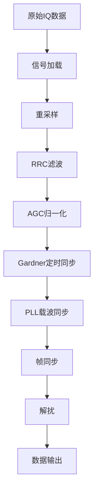
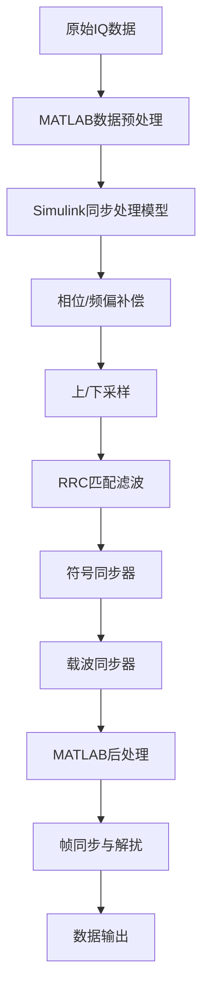

# 基于真实卫星数据的QPSK接收机教学案例设计与实现

## Abstract

To address the gap between theory and practice in communication system modeling and simulation teaching, and the lack of experience in processing real engineering data, this paper designs and implements a QPSK receiver teaching case based on real satellite downlink data. The case uses SAR satellite intermediate frequency IQ data received during the 70th anniversary of Beijing University of Posts and Telecommunications to construct a complete signal processing chain from signal preprocessing, synchronization recovery to data demodulation. The system adopts an open technical path design, allowing students to independently choose implementation solutions based on their technical background. It includes core modules such as RRC matched filtering, Gardner timing synchronization, PLL carrier recovery, frame synchronization, and descrambling, each accompanied by detailed theoretical analysis and visual debugging interfaces. Through practical application verification by three groups of students who independently chose different technical paths (Cheng Zirui's pure MATLAB path, Wang Tongxi and Wang Yuxiang's Simulink hybrid path), the case achieved good teaching effects under different technical solutions. Teaching practice shows that this case effectively enhances students' understanding of the working principles of digital communication receivers and strengthens their engineering practice capabilities.

**Keywords**: QPSK; satellite communication; teaching case; MATLAB simulation; Simulink modeling

## 摘要

鉴于通信系统建模仿真教学工作中所存在的理论与实践脱节、以及缺少处理真实工程数据经验的问题，本文设计并实现了一个基于真实卫星下行数据的QPSK接收机教学案例。这个案例选用了在北京邮电大学70周年校庆期间所接收到的SAR卫星中频IQ数据，去构建了一条从信号预处理、同步恢复一直到数据解调的完整信号处理链路。系统选用了一种开放式的技术路径设计，学生们可以依据自己的技术背景来自主选择具体的实现方案。它的核心模块囊括了RRC匹配滤波、Gardner定时同步、PLL载波恢复、帧同步以及解扰等，并且每一个模块都配备有详尽的理论分析和可视化的调试界面。借助三组学生自主选择不同技术路径所开展的实际应用验证（比如程梓睿同学的纯MATLAB路径，以及汪曈熙和汪宇翔同学的Simulink混合路径），这个案例在不同的技术方案下面都取得了良好的教学效果。教学实践表明，这个案例可以有效地去提升学生们对于数字通信接收机工作原理的理解程度，同时也增强了他们的工程实践能力。

**关键词**：QPSK；卫星通信；教学案例；MATLAB仿真；Simulink建模

## 1. 引言

在新一轮的科技革命以及产业变革的共同推动之下，“新工科”的建设工作已经成为了我国高等工程教育改革的一个核心议题，其目的在于去培养那种能够应对未来挑战的创新型工程科技人才[2, 3]。通信工程一直被当作信息产业当中的一个关键领域，它的人才培养模式也亟待进行升级。然而，传统的通信教学往往会把重点放在理论推导这个方面，这就导致学生在面对真实且复杂的工程问题时，会普遍存在系统性思维以及工程实践能力不足的这么一个问题。为了弥合理论与实践之间的这道鸿沟，把项目式学习也就是PBL，同软件无线电即SDR技术进行结合的这种方式，为教学改革提供了一条新的思路[4, 1]。

尽管如此，当前的通信系统建模仿真教学工作仍然面临着一些挑战：其中多数案例都依赖于理想化的信号，这使得学生们难以获得去处理真实信道损伤的经验[1]；同时，实验内容大多停留在单一算法的验证层面，导致学生对于完整的通信链路缺乏整体上的把握；学生在如何根据信号特征来选择算法、以及如何去调试和优化系统参数等这些关键工程能力的训练方面也显得不足。

为了应对上述的这些挑战，本文基于在北京邮电大学“通信系统仿真与建模”这门课程的教学实践，提出了一个基于真实卫星数据来开展的QPSK接收机教学案例。这个案例选用了在北邮70周年校庆期间所真实接收到的SAR卫星下行数据，并且把一个完整的QPSK接收机当作项目目标，来引导学生们去完成从数据分析、系统设计、模块实现一直到联调测试的这么一个全过程。这个案例的一大特性体现在它的开放式技术路径方面，它并不去限定具体的实现方法，学生们可以自主地去选择纯MATLAB编程，或者是选择MATLAB与Simulink混合建模的这种技术路径。

本文的主要贡献点在于：首先，它构建了一个基于真实卫星数据来开展的完整QPSK接收机教学案例，并把它当作课程的一个创新结课项目[2, 6]；其次，借助开放式的技术路径设计，去鼓励学生进行自主决策，从而培养他们独立思考以及技术创新的能力；最后，依靠三组学生在不同技术路径下所取得的成功实践，验证了项目驱动式教学的有效性，也为新工科背景之下的通信工程实践教学改革工作，提供了可以参考的教学资源以及实践经验。

## 2. 相关工作

“新工科”建设的核心任务在于去重塑工程教育，来培养学生的创新能力以及解决复杂工程问题的能力[2]。项目式学习，也就是PBL，被认为是能够实现这一目标的关键教学模式，它会通过引导学生去完成一个完整的项目，来把理论知识应用到实践当中，从而有效地提升学生的综合素质[4]。这些研究所提供的教学理念，为本案例的设计工作奠定了坚实的基础。

软件无线电，即SDR技术的发展，极大程度上推动了通信工程的实践教学工作。伴随着低成本SDR硬件的普及，学生们已经能够在个人的计算机上去完成对真实无线电信号的捕捉以及分析工作，这极大程度上降低了工程实践的门槛[5]。有团队在前期工作中所提出的“口袋化”软件无线电实践教学理念，为解决理论与实践脱节的这类问题提供了一个初步的方案[1]，而本案例则是在这个基础之上所开展的进一步深化。

在通信系统的教学工作当中，像MATLAB/Simulink这样的仿真平台扮演着一个至关重要的角色。在卫星通信这个领域，已经有研究借助这些平台来对DVB-S2等标准去进行系统级的建模以及仿真[7]。然而，现有的研究大多都集中在理想化的模型上，把仿真平台应用到去处理**真实采集到的卫星信号**的这类教学案例则相对比较少[8]，而这恰好就是本项研究所切入的一个要点和创新点之一。

## 3. 系统设计与核心算法

### 3.1 总体架构与设计思路

本教学案例所设定的核心目标，是去培养学生能够深入地理解QPSK解调以及同步理论、掌握数字接收机的整体架构，并且具备处理真实数据和解决实际工程问题的综合能力。为此，该设计基于空间数据系统咨询委员会也就是CCSDS的标准，设定了一条明确的技术路线：它选用了QPSK调制，符号率设定为75 MBaud/s，脉冲成形选用的是滚降系数α为0.33的RRC滤波，同步策略则选用了定时同步以及载波同步，并且还遵循了先进轨道系统即AOS的帧结构。

为了激发学生们的自主性以及创造性，这个案例选用了一种开放式的设计，能够支持学生依据自身的兴趣以及能力，来选择不同的路径去完成整个任务。下面所列出的是学生们自己所选择的两种实现路径。

**路径一：纯MATLAB编程的实现路径**，这条路径会要求学生借助编写代码的方式，来自主地实现接收机当中的每一个功能模块，这对算法的理解程度要求比较高。


**路径二：MATLAB与Simulink混合的实现路径**，这条路径允许学生去运用Simulink所拥有的图形化建模环境来搭建系统框架，并且结合MATLAB去进行数据的预处理以及后处理工作，它会更加侧重于系统级的集成与调试这个方面。


### 3.2 核心算法模块实现

#### 3.2.1 RRC匹配滤波器
根升余弦也就是RRC滤波器，是在数字通信当中用来最大化信噪比以及减小码间串扰的一个关键部分。其设计的重点在于去理解滚降系数α对于带宽效率以及抗定时误差能力所产生的影响，以及收发两端的RRC滤波器在级联之后构成升余弦即RC滤波器的这么一个匹配滤波原理。在这个案例当中，滤波器的滚降系数α被设定为0.33，它覆盖了8个符号的长度，并且在进行了重采样之后，得以实现每符号有3个采样点的效果。

#### 3.2.2 Gardner定时同步算法
Gardner算法属于一种非数据辅助的符号定时恢复算法，它会借助在每个符号周期内对判决点以及中点去进行采样，来计算出定时的误差。为了追求更高的定时精度，程梓睿同学在其纯MATLAB的实现当中，选用了一个3阶的Farrow立方插值器。和传统的线性插值相比，它能够提供更为精确的分数延迟插值，在高符号率的系统里面优势会很明显。同步环路选用了二阶的PI控制器，它的环路带宽以及阻尼系数的设定，是教学工作当中的一个关键点，学生们需要去权衡环路的跟踪性能与噪声抑制能力这两个方面。

#### 3.2.3 PLL载波恢复算法
针对载波恢复这个环节，不同的技术路径选用了不一样的策略。纯MATLAB的路径实现了一种判决辅助的二阶锁相环即PLL，它会依靠把接收信号与硬判决结果进行共轭相乘的方式来提取相位误差。而Simulink混合路径则运用了像Costas环或者四次方环这类非数据辅助的算法，它是借助调用Simulink库里面所内置的载波同步模块来实现的。对这些不同方法的比较，可以让学生能够更深入地去理解判决辅助与非判决辅助算法之间的差异、它们的适用场景，以及锁相环的工作原理和稳定性。

#### 3.2.4 帧同步与相位模糊恢复
鉴于QPSK星座图所具有的π/2旋转对称性，在进行了载波恢复之后，常常会存在相位模糊的问题。本案例选用了一种穷举搜索的方法来解决这个问题：它会对接收到的信号应用四种可能的相位校正，也就是0°、90°、180°以及270°，然后把它同已知的32比特同步字`0x1ACFFC1D`去进行相关运算，并选择相关峰值最大的那个相位来当作正确的相位。这么一个过程把帧同步与相位模糊的恢复工作联合进行了处理，是整个接收机设计当中的一个关键环节。

为了辅助学生们去进行调试与验证的工作，案例还设计了丰富的可视化工具，比如星座图、频谱图、功率曲线以及相位跟踪曲线，并且也提供了明确的性能指标，像星座图的清晰度、AOS帧头能否被正确解析，以及帧计数器的连续性等。

## 4. 实现、验证与教学效果分析

本案例被当作“通信系统仿真与建模”这门课程的一个可选提高项目，它会引导学生们在4到6周的时间内，去完成从设计、开发一直到最终完成的这么一个全过程。项目的开放性主要体现在技术路径的自主选择这个方面，有三组学生基于自身的背景以及兴趣，分别选用了纯MATLAB、混合架构以及向量化优化的实现方案，而他们的实践成果也充分地验证了这种教学模式的有效性。

### 4.1 三种技术路径的实现与对比

这三位学生的实现路径各有侧重，它们的技术特性对比如下表所示：

| 维度 | 程梓睿（纯MATLAB） | 汪曈熙（混合架构） | 汪宇翔（向量化优化） |
| :--- | :--- | :--- | :--- |
| **技术架构** | 完全模块化编程 | Simulink+MATLAB混合 | 分阶段向量化处理 |
| **核心创新** | Farrow立方插值器优化 | 系统级建模与集成 | 向量化矩阵操作 |
| **同步算法** | Gardner+二阶PI环路 | Simulink内置同步器 | Simulink内置同步器 |
| **载波恢复** | 判决反馈PLL | Simulink内置恢复模块 | 载波同步器模块 |
| **解扰实现** | 智能IQ交换验证 | 标准PRBS序列解扰 | 向量化批量异或 |
| **调试特点** | 断点逐步调试 | 可视化信号监控 | 详细分析报告 |
| **工程价值** | 算法理解深入 | 系统建模直观 | 高效处理实现 |

**程梓睿同学的纯MATLAB路径**，更加注重算法的深度实现工作。他构建了24个独立的函数模块，特别是在进行Gardner符号同步的时候创新性地运用了3阶的Farrow立方插值器，从而提升了定时的精度。除此之外，他还设计了自动化的IQ路交换以及解扰验证机制，能够依靠对帧尾标志位的检查来自动地纠正相位模糊，这展现出了他扎实的编程功底以及对算法的深入理解。

**汪曈熙同学的混合架构路径**，则把侧重点放在了系统级建模与工程实践这个方面。他运用Simulink所拥有的可视化能力，清晰地搭建起了信号处理的链路，并且成功地集成了一个标准的CCSDS LDPC解码器模块。在实践过程当中，他发现了AGC与Gardner环路之间存在的相互干扰问题，并且借助参数的调整来予以解决，这一点充分地体现出了他在系统联调以及工程问题解决方面的能力。

**汪宇翔同学的向量化优化路径**则主要聚焦于算法的执行效率。他运用了MATLAB所具备的矩阵运算优势，借助`bsxfun`函数来构造滑动窗口矩阵，以此替代传统的循环搜索方法，极大程度上提升了同步字检测的效率。同时，他对帧提取以及解扰的过程也进行了向量化的处理工作，这展现出了他在处理海量数据时所具备的高性能计算思维。

### 4.2 技术验证与教学效果

所有的技术路径都成功地完成了对真实卫星数据的解调工作。以纯MATLAB的实现方案为例，图4.1当中展示了原始信号的频谱，而图4.2与图4.3则清晰地显示了信号从进行了定时同步之后，一直到载波同步完成之后的这么一个星座图收敛过程，这证明了同步模块的有效性。


<center>图4.1 卫星滤波前QPSK调制信号频谱</center>


<center>图4.2 定时同步后的星座图（环形分布）</center>


<center>图4.3 载波同步后的QPSK星座图</center>

最终，这个系统能够稳定地检测到帧同步字（具体可以参见图4.4），并且成功地解析出了连续的AOS帧头信息。在正确地读取了数据字节之后，得到了带有70字样的图像（如图4.5所示）。


<center>图4.4 帧同步检测位置图</center>


<center>图4.5 北邮校庆70字样图像</center>

```
--- AOS Frame Header Decoded ---
                   versionId: 1
                satelliteType: "03组"
    satelliteVirtualChannelId: "03组 有效数据"
         satelliteVCDUCounter: 532605
             satelliteReplyId: "回放"
          satelliteDownloadId: "单路下传"
            satelliteIQDataId: "I路"
        satelliteDigitalSpeed: "150Mbps"
--------------------------------
```

从教学效果这个方面来看，该案例显著地提升了学生在多个维度上的能力。在**工程实践能力**这个方面，学生们通过去处理真实的数据，学会了如何去分析并解决像同步失锁、参数失配等这类实际问题。在**系统设计思维**这个方面，学生们不再只是局限于单一的算法，而是能够从系统整体的角度来权衡各个模块的性能以及它们之间的相互影响。在**问题解决能力**这个方面，学生们在实践当中自主地解决了诸如“星座图旋转不停”（依靠调整PLL环路带宽来解决）以及“帧同步失败”（依靠改进相位搜索算法来解决）等一些典型的问题。

学生们的反馈普遍都比较积极，他们认为去处理真实数据极大程度上增强了学习的兴趣，而不同技术路径的实现过程也加深了他们对通信系统理论的理解。自主选择技术路径的这种模式，满足了个性化的学习偏好，也激发了大家对于技术探索的热情。无论是那些偏好算法理论、系统工程还是性能优化的学生，都在这个项目当中找到了适宜自己的挑战，并且取得了技术上的突破。

## 5. 结论与展望

本文设计并实现了一个基于真实卫星数据来开展的QPSK接收机教学案例，它的核心创新点在于**开放式技术路径**的这个设计理念。借助三组学生分别选用纯MATLAB编程、MATLAB与Simulink混合架构以及向量化优化方案所取得的成功实践，验证了这种教学模式能够有效地去弥合理论与实践之间的鸿沟，并且能够培养学生的独立思考、系统设计以及工程实践的能力。

这三种技术路径的成功实践，揭示了该教学模式所具有的多元价值：纯MATLAB路径有助于去深化学生们对于底层算法的理解；混合架构路径则能够有效地去培养学生在系统级建模以及工程集成方面的能力；而向量化优化路径则锻炼了学生们对于性能优化的追求和进行高效计算的思维。这种允许学生进行自主选择的模式，不仅满足了个性化的学习需求，也激发了他们的学习主动性，更重要的是，它借助不同方案之间的对比学习，拓宽了学生们的技术视野。

作为北京邮电大学70周年校庆的一项教学成果，本案例为新工科背景之下的通信工程实践教学改革工作，提供了有价值的参考以及示范。在未来，该案例将会向着更广阔的技术领域去进行拓展，比如去支持像16QAM这样的更高阶调制方式，集成像LDPC这样的信道编码算法，并且还计划去开发Python版本以及Web在线仿真平台，来服务于更为广泛的教学与科研场景，从而为培养能够适应新时代需求的创新型工程人才去持续地贡献力量。

## 参考文献

[1] 刘奕彤, 尹良, 郑平, 顾仁涛, 杨鸿文. 基于口袋化的软件无线电通信实践教学创新[J]. 实验室研究与探索, 2022, 41(9): 204-207.

[2] 周依. 新工科理念下通信工程专业实践教学改革研究. 教育探讨. 2024 Oct 14;6(3).

[3] 蒋帅捷.“互联网+”视域下通信工程专业人才培养对策研究[J].中国新通信,2024,26(22):98-100

[4] Gao, Hongfeng, et al. "Project-Based Communication System Design Course." 2016 International Seminar on Education Innovation and Economic Management (SEIEM 2016). Atlantis Press, 2016.

[5] Stewart, Robert W., et al. "A low-cost desktop software defined radio design environment using MATLAB, simulink, and the RTL-SDR." IEEE Communications Magazine 53.9 (2015): 64-71.

[6] 丁汉,曾惠霞,肖平.新工科背景下Matlab与通信系统仿真课程的探索与实践[J].电脑知识与技术,2025,21(7):144-146

[7] Baotic, Perica, et al. "Simulation model of DVB-S2 system." Proceedings ELMAR-2013. IEEE, 2013.

[8] Abusedra, Lamia Fathi, Amer Mohamed Daeri, and Amer Ragab Zerek. "Implementation and performance study of the LDPC coding in the DVB-S2 link system using MATLAB." 2016 17th International Conference on Sciences and Techniques of Automatic Control and Computer Engineering (STA). IEEE, 2016.