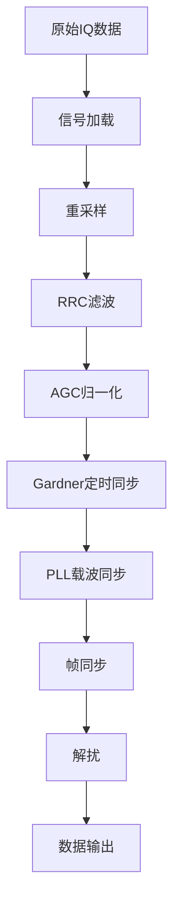
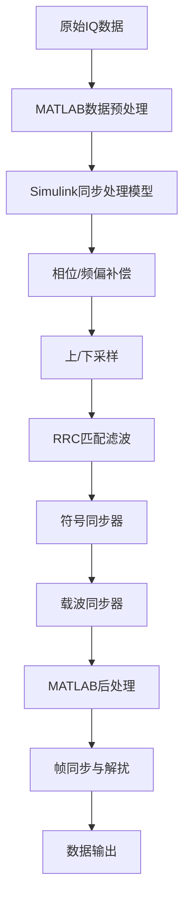
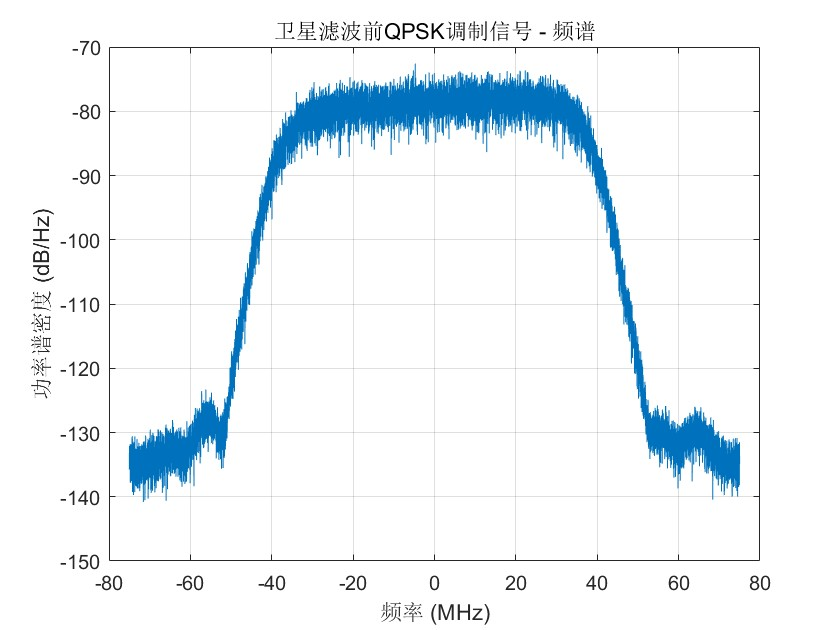
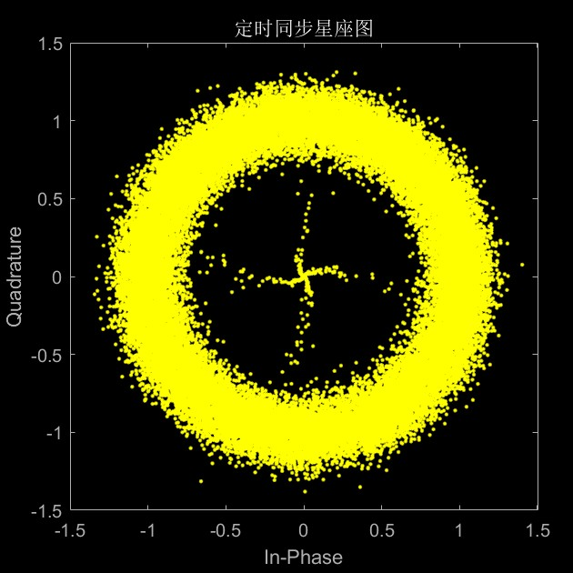
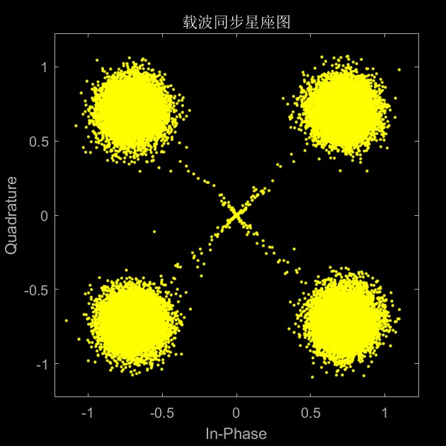
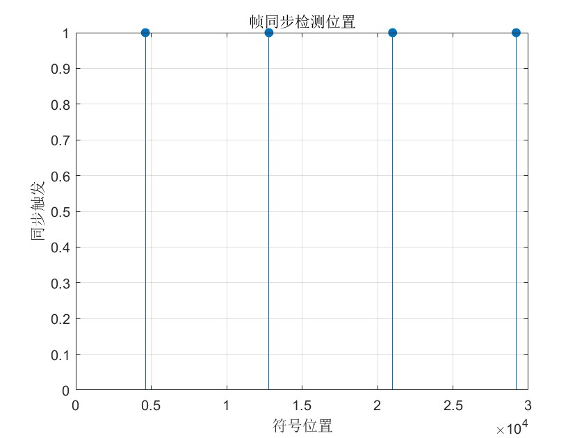

# 基于真实卫星数据的QPSK接收机教学案例设计与实现

## Abstract

To address the gap between theory and practice in communication system modeling and simulation teaching, and the lack of experience in processing real engineering data, this paper designs and implements a QPSK receiver teaching case based on real satellite downlink data. The case uses SAR satellite intermediate frequency IQ data received during the 70th anniversary of Beijing University of Posts and Telecommunications to construct a complete signal processing chain from signal preprocessing, synchronization recovery to data demodulation. The system adopts an open technical path design, allowing students to independently choose implementation solutions based on their technical background. It includes core modules such as RRC matched filtering, Gardner timing synchronization, PLL carrier recovery, frame synchronization, and descrambling, each accompanied by detailed theoretical analysis and visual debugging interfaces. Through practical application verification by three groups of students who independently chose different technical paths (Cheng Zirui's pure MATLAB path, Wang Tongxi and Wang Yuxiang's Simulink hybrid path), the case achieved good teaching effects under different technical solutions. Teaching practice shows that this case effectively enhances students' understanding of the working principles of digital communication receivers and strengthens their engineering practice capabilities.

**Keywords**: QPSK; satellite communication; teaching case; MATLAB simulation; Simulink modeling

## 摘要

针对通信系统建模仿真教学中理论与实践脱节、缺乏真实工程数据处理经验的问题，本文设计并实现了一个基于真实卫星下行数据的QPSK接收机教学案例。该案例采用北京邮电大学70周年校庆期间接收的SAR卫星中频IQ数据，构建了从信号预处理、同步恢复到数据解调的完整信号处理链路。系统采用开放式技术路径设计，学生可根据自身技术背景自主选择实现方案，包含RRC匹配滤波、Gardner定时同步、PLL载波恢复、帧同步与解扰等核心模块，每个模块都配有详细的理论分析和可视化调试界面。通过三组学生自主选择不同技术路径的实际应用验证（程梓睿的纯MATLAB路径、汪曈熙和汪宇翔的Simulink混合路径），该案例在不同技术方案下均取得良好教学效果。教学实践表明，该案例有效提升了学生对数字通信接收机工作原理的理解，增强了工程实践能力。

**关键词**：QPSK；卫星通信；教学案例；MATLAB仿真；Simulink建模

## 1. 引言

在新一轮科技革命和产业变革的推动下，“新工科”建设成为中国高等工程教育改革的核心议题，旨在培养能够应对未来挑战的创新型工程科技人才[2, 3]。通信工程作为信息产业的关键领域，其人才培养模式亟待升级。然而，传统通信教学往往侧重理论推导，学生在面对真实复杂的工程问题时，普遍存在系统性思维和工程实践能力不足的问题。为弥合理论与实践的鸿沟，项目式学习（Project-Based Learning, PBL）与软件无线电（Software-Defined Radio, SDR）技术相结合，为教学改革提供了新思路[4, 1]。

尽管如此，当前通信系统建模仿真教学仍面临挑战：多数案例依赖理想化信号，学生难以获得处理真实信道损伤的经验[1]；实验多停留在单一算法验证，学生缺乏对完整通信链路的整体把握；学生对于如何根据信号特征选择算法、调试和优化系统参数等关键工程能力的训练不足。

为应对上述挑战，本文基于北京邮电大学“通信系统仿真与建模”课程的教学实践，提出了一个基于真实卫星数据的QPSK接收机教学案例。该案例采用北邮70周年校庆期间真实接收的SAR卫星下行数据，以完整的QPSK接收机为项目目标，引导学生完成从数据分析、系统设计、模块实现到联调测试的全过程。案例的一大特色是开放式技术路径，不限定具体实现方法，学生可自主选择纯MATLAB编程或MATLAB与Simulink混合建模的技术路径。

本文的主要贡献在于：首先，构建了一个基于真实卫星数据的完整QPSK接收机教学案例，作为课程的创新结课项目[2, 6]；其次，通过开放式技术路径设计，鼓励学生自主决策，培养其独立思考与技术创新能力；最后，通过三组学生在不同技术路径下的成功实践，验证了项目驱动式教学的有效性，为新工科背景下的通信工程实践教学改革提供了可参考的教学资源与实践经验。

## 2. 相关工作

“新工科”建设的核心是重塑工程教育，培养学生的创新能力和解决复杂工程问题的能力[2]。项目式学习（PBL）被认为是实现这一目标的关键教学模式，它通过引导学生完成完整项目，将理论知识应用于实践，有效提升综合素质[4]。这些研究为本案例的设计提供了坚实的教学理念基础。

软件无线电（SDR）技术的发展极大地推动了通信工程的实践教学。随着低成本SDR硬件的普及，学生能够在个人计算机上完成对真实无线电信号的捕捉和分析，极大地降低了工程实践的门槛[5]。我们团队在前期工作中提出的“口袋化”软件无线电实践教学理念，为解决理论与实践脱节问题提供了初步方案[1]，本案例是在此基础上的进一步深化。

在通信系统教学中，MATLAB/Simulink等仿真平台扮演着至关重要的角色。在卫星通信领域，已有研究利用这些平台对DVB-S2等标准进行系统级建模与仿真[7]。然而，现有研究多集中于理想化模型，将仿真平台应用于处理**真实采集的卫星信号**的教学案例则相对较少[8]，这正是本研究的切入点和创新点之一。

## 3. 系统设计与核心算法

### 3.1 总体架构与设计思路

本教学案例的核心目标是培养学生深入理解QPSK解调及同步理论、掌握数字接收机整体架构、具备处理真实数据和解决实际工程问题的综合能力。为此，我们基于CCSDS（空间数据系统咨询委员会）标准，设定了明确的技术路线：采用QPSK调制，符号率为75 MBaud/s，脉冲成形为滚降系数α=0.33的RRC滤波，同步策略为定时同步与载波同步，并遵循AOS（先进轨道系统）帧结构。

为激发学生的自主性和创造性，案例采用了开放式设计，支持学生根据自身兴趣与能力选择不同路径来完成任务。以下为学生自己选择的两种实现路径。

**路径一：纯MATLAB编程实现**，此路径要求学生通过编写代码，自主实现接收机的每一个功能模块，对算法理解要求较高。


**路径二：MATLAB与Simulink混合实现**，此路径允许学生利用Simulink的图形化建模环境搭建系统框架，并结合MATLAB进行数据预处理和后处理，更侧重于系统级集成与调试。


### 3.2 核心算法模块实现

#### 3.2.1 RRC匹配滤波器
根升余弦（RRC）滤波器是数字通信中最大化信噪比和减小码间串扰的关键。其设计重点在于理解滚降系数α对带宽效率和抗定时误差能力的影响，以及收发两端RRC滤波器级联后构成升余弦（RC）滤波器的匹配滤波原理。在本案例中，滤波器滚降系数α=0.33，覆盖8个符号长度，并在重采样后实现每符号3个采样点。

#### 3.2.2 Gardner定时同步算法
Gardner算法是一种非数据辅助的符号定时恢复算法，通过在每个符号周期内对判决点和中点进行采样来计算定时误差。为追求更高的定时精度，程梓睿同学的纯MATLAB实现中采用了4阶Farrow立方插值器，相比传统线性插值，它能提供更精确的分数延迟插值，在高符号率系统中优势明显。同步环路采用二阶PI控制器，其环路带宽和阻尼系数的设定是教学中的一个关键点，学生需要权衡环路的跟踪性能与噪声抑制能力。

#### 3.2.3 PLL载波恢复算法
针对载波恢复，不同技术路径采用了不同策略。纯MATLAB路径实现了一种判决辅助的二阶锁相环（PLL），通过将接收信号与硬判决结果共轭相乘来提取相位误差。而Simulink混合路径则利用了Costas环或四次方环等非数据辅助算法。这些不同方法的比较，让学生能够深入理解判决辅助与非判决辅助算法的差异、适用场景以及锁相环的工作原理与稳定性。

#### 3.2.4 帧同步与相位模糊恢复
由于QPSK星座图的π/2旋转对称性，载波恢复后常存在相位模糊。本案例采用穷举搜索法解决此问题：对接收信号应用四种可能的相位校正（0°, 90°, 180°, 270°），然后与已知的32比特同步字`0x1ACFFC1D`进行相关运算，选择相关峰值最大的相位作为正确相位。这一过程将帧同步与相位模糊恢复联合处理，是接收机设计的关键环节。

为辅助学生调试与验证，案例设计了丰富的可视化工具，如星座图、频谱图、功率曲线和相位跟踪曲线，并提供了明确的性能指标，如星座图清晰度、AOS帧头能否正确解析以及帧计数器的连续性。

## 4. 实现、验证与教学效果分析

本案例作为“通信系统仿真与建模”课程的可选提高项目，引导学生在4至6周内完成从设计、开发到完成的全过程。项目的开放性体现在技术路径的自主选择上，三组学生基于自身背景和兴趣分别选择了纯MATLAB、混合架构和向量化优化的实现方案，他们的实践成果充分验证了该教学模式的有效性。

### 4.1 三种技术路径的实现与对比

三位学生的实现路径各有侧重，其技术特点对比如下表所示：

| 维度 | 程梓睿（纯MATLAB） | 汪曈熙（混合架构） | 汪宇翔（向量化优化） |
| :--- | :--- | :--- | :--- |
| **技术架构** | 完全模块化编程 | Simulink+MATLAB混合 | 分阶段向量化处理 |
| **核心创新** | Farrow立方插值器优化 | 系统级建模与集成 | 向量化矩阵操作 |
| **同步算法** | Gardner+二阶PI环路 | Simulink内置同步器 | Simulink内置同步器 |
| **载波恢复** | 判决反馈PLL | Simulink内置恢复模块 | 载波同步器模块 |
| **解扰实现** | 智能IQ交换验证 | 标准PRBS序列解扰 | 向量化批量异或 |
| **调试特点** | 断点逐步调试 | 可视化信号监控 | 详细分析报告 |
| **工程价值** | 算法理解深入 | 系统建模直观 | 高效处理实现 |

**程梓睿的纯MATLAB路径**注重算法的深度实现。他构建了24个独立的函数模块，特别是在Gardner符号同步中创新性地应用了4阶Farrow立方插值器，提升了定时精度。此外，他还设计了自动IQ路交换和解扰验证机制，能通过检查帧尾标志位自动纠正相位模糊，展现了扎实的编程功底和深入的算法理解。

**汪曈熙的混合架构路径**侧重于系统级建模与工程实践。他利用Simulink的可视化能力清晰地搭建了信号处理链路，并成功集成了标准的CCSDS LDPC解码器模块。在实践中，他发现了AGC与Gardner环路间的相互干扰问题，并通过参数调整予以解决，这充分体现了其系统联调与工程问题解决能力。

**汪宇翔的向量化优化路径**则聚焦于算法的执行效率。他利用MATLAB的矩阵运算优势，通过`bsxfun`函数构造滑动窗口矩阵来替代传统的循环搜索，极大地提升了同步字检测的效率。同时，他对帧提取和解扰过程也进行了向量化处理，展现了在处理海量数据时的高性能计算思维。

### 4.2 技术验证与教学效果

所有技术路径都成功完成了对真实卫星数据的解调。以纯MATLAB实现为例，图4.1展示了原始信号的频谱，图4.2和4.3清晰地显示了信号从定时同步后到载波同步后星座图的收敛过程，证明了同步模块的有效性。


<center>图4.1 卫星滤波前QPSK调制信号频谱</center>


<center>图4.2 定时同步后的星座图（环形分布）</center>


<center>图4.3 载波同步后的QPSK星座图</center>

最终，系统能够稳定地检测到帧同步字（如图4.4所示），并成功解析出连续的AOS帧头信息，其帧计数器的正常递增标志着整个接收机链路的功能正确性。


<center>图4.4 帧同步检测位置图</center>

```
--- AOS Frame Header Decoded ---
                   versionId: 1
                satelliteType: "03组"
    satelliteVirtualChannelId: "03组 有效数据"
         satelliteVCDUCounter: 532605
             satelliteReplyId: "回放"
          satelliteDownloadId: "单路下传"
            satelliteIQDataId: "I路"
        satelliteDigitalSpeed: "150Mbps"
--------------------------------
```

从教学效果来看，该案例显著提升了学生多维度的能力。在**工程实践能力**方面，学生通过处理真实数据，学会了分析和解决同步失锁、参数失配等实际问题。在**系统设计思维**方面，学生们不再局限于单一算法，而是从系统整体角度权衡各模块性能与相互影响。在**问题解决能力**方面，学生们在实践中自主解决了诸如“星座图旋转不停”（通过调整PLL环路带宽）和“帧同步失败”（通过改进相位搜索算法）等典型问题。

学生反馈普遍积极，他们认为处理真实数据极大地增强了学习兴趣，不同技术路径的实现加深了对通信系统理论的理解。自主选择技术路径的模式满足了个性化的学习偏好，激发了技术探索的热情，无论是偏好算法理论、系统工程还是性能优化的学生，都在项目中找到了适合自己的挑战并取得了技术突破。

## 5. 结论与展望

本文设计并实现了一个基于真实卫星数据的QPSK接收机教学案例，其核心创新在于**开放式技术路径**的设计理念。通过三组学生分别采用纯MATLAB编程、MATLAB与Simulink混合架构以及向量化优化方案的成功实践，验证了该教学模式能够有效弥合理论与实践的鸿沟，并培养学生的独立思考、系统设计与工程实践能力。

三种技术路径的成功实践揭示了该教学模式的多元价值：纯MATLAB路径有助于深化学生对底层算法的理解；混合架构路径则能有效培养学生的系统级建模与工程集成能力；而向量化优化路径则锻炼了学生对性能优化的追求和高效计算的思维。这种允许学生自主选择的模式，不仅满足了个性化的学习需求，激发了学习主动性，更通过不同方案间的对比学习，拓宽了学生的技术视野。

作为北京邮电大学70周年校庆的教学成果，本案例为新工科背景下的通信工程实践教学改革提供了有价值的参考和示范。未来，该案例将向更广阔的技术领域拓展，例如支持16QAM等更高阶的调制方式，集成LDPC等信道编码算法，并计划开发Python版本及Web在线仿真平台，以服务于更广泛的教学与科研场景，为培养适应新时代需求的创新型工程人才持续贡献力量。

## 参考文献

[1] 刘奕彤, 尹良, 郑平, 顾仁涛, 杨鸿文. 基于口袋化的软件无线电通信实践教学创新[J]. 实验室研究与探索, 2022, 41(9): 204-207.
[2] 周依. 新工科理念下通信工程专业实践教学改革研究. 教育探讨. 2024 Oct 14;6(3).
[3] 蒋帅捷.“互联网+”视域下通信工程专业人才培养对策研究[J].中国新通信,2024,26(22):98-100
[4] Gao, Hongfeng, et al. "Project-Based Communication System Design Course." 2016 International Seminar on Education Innovation and Economic Management (SEIEM 2016). Atlantis Press, 2016.
[5] Stewart, Robert W., et al. "A low-cost desktop software defined radio design environment using MATLAB, simulink, and the RTL-SDR." IEEE Communications Magazine 53.9 (2015): 64-71.
[6] 丁汉,曾惠霞,肖平.新工科背景下Matlab与通信系统仿真课程的探索与实践[J].电脑知识与技术,2025,21(7):144-146
[7] Baotic, Perica, et al. "Simulation model of DVB-S2 system." Proceedings ELMAR-2013. IEEE, 2013.
[8] Abusedra, Lamia Fathi, Amer Mohamed Daeri, and Amer Ragab Zerek. "Implementation and performance study of the LDPC coding in the DVB-S2 link system using MATLAB." 2016 17th International Conference on Sciences and Techniques of Automatic Control and Computer Engineering (STA). IEEE, 2016.