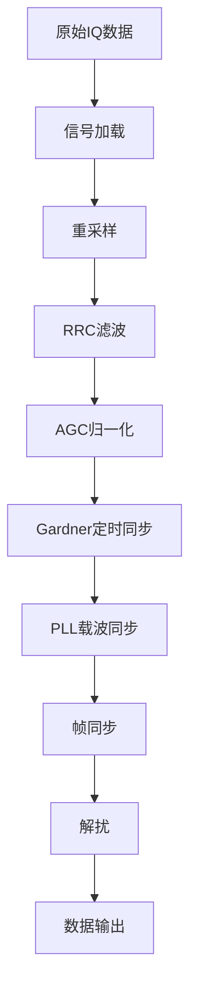
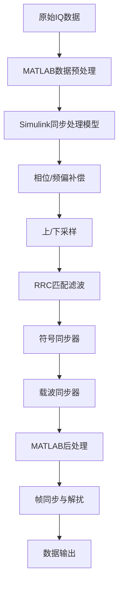

# 基于真实卫星数据的QPSK接收机教学案例设计与实现

## Abstract

To address the gap between theory and practice in communication system modeling and simulation teaching, and the lack of experience in processing real engineering data, this paper designs and implements a QPSK receiver teaching case based on real satellite downlink data. The case uses SAR satellite intermediate frequency IQ data received during the 70th anniversary of Beijing University of Posts and Telecommunications to construct a complete signal processing chain from signal preprocessing, synchronization recovery to data demodulation. The system adopts an open technical path design, allowing students to independently choose implementation solutions based on their technical background. It includes core modules such as RRC matched filtering, Gardner timing synchronization, PLL carrier recovery, frame synchronization, and descrambling, each accompanied by detailed theoretical analysis and visual debugging interfaces. Through practical application verification by three groups of students who independently chose different technical paths (Cheng Zirui's pure MATLAB path, Wang Tongxi and Wang Yuxiang's Simulink hybrid path), the case achieved good teaching effects under different technical solutions. Teaching practice shows that this case effectively enhances students' understanding of the working principles of digital communication receivers and strengthens their engineering practice capabilities.

**Keywords**: QPSK; satellite communication; teaching case; MATLAB simulation; Simulink modeling

## 摘要

针对通信系统建模仿真教学中理论与实践脱节、缺乏真实工程数据处理经验的问题，本文设计并实现了一个基于真实卫星下行数据的QPSK接收机教学案例。该案例采用北京邮电大学70周年校庆期间接收的SAR卫星中频IQ数据，构建了从信号预处理、同步恢复到数据解调的完整信号处理链路。系统采用开放式技术路径设计，学生可根据自身技术背景自主选择实现方案，包含RRC匹配滤波、Gardner定时同步、PLL载波恢复、帧同步与解扰等核心模块，每个模块都配有详细的理论分析和可视化调试界面。通过三组学生自主选择不同技术路径的实际应用验证（程梓睿的纯MATLAB路径、汪曈熙和汪宇翔的Simulink混合路径），该案例在不同技术方案下均取得良好教学效果。教学实践表明，该案例有效提升了学生对数字通信接收机工作原理的理解，增强了工程实践能力。

**关键词**：QPSK；卫星通信；教学案例；MATLAB仿真；Simulink建模

## 1. 引言

### 1.1 研究背景

在新一轮科技革命和产业变革的推动下，“新工科”建设成为中国高等工程教育改革的核心议题，旨在培养能够应对未来挑战的创新型工程科技人才[2]。通信工程作为信息产业的关键领域，其人才培养模式亟待升级。然而，传统的通信系统教学往往侧重理论推导，采用理想化的仿真模型，导致理论与实践脱节，学生在面对真实复杂的工程问题时，普遍存在系统性思维和工程实践能力不足的问题[3, 4]。

为了弥合这一鸿沟，项目式学习（Project-Based Learning, PBL）作为一种行之有效的教学方法受到广泛关注。PBL强调让学生在真实或准真实的项目中主动探索，将零散的知识点融会贯通，从而提升综合能力与创新精神[5]。在通信领域，将PBL与前沿技术相结合已成为教学改革的重要方向。特别是软件无线电（Software-Defined Radio, SDR）技术，它将通信功能从硬件固化中解放出来，通过软件编程实现，为学生提供了一个灵活、低成本的平台来处理真实无线电信号，极大地降低了工程实践的门槛[6, 7]。

### 1.2 问题分析

尽管PBL和SDR为教学改革提供了新的思路，但当前通信系统建模仿真教学仍面临挑战：
1.  **理论与实践脱节**：多数教学案例仍依赖于理想化的仿真信号，学生难以获得处理真实信道损伤（如频偏、相噪、定时误差）的宝贵经验[1]。
2.  **缺乏系统性认知**：许多实验停留在单一算法验证层面，学生难以将RRC滤波、定时同步、载波恢复、帧同步等模块联系起来，缺乏对完整通信链路的整体把握。
3.  **工程能力培养不足**：学生习惯于给定参数的仿真，对于如何根据信号特征选择合适的算法、如何调试和优化系统参数等关键工程能力训练不足。
4.  **创新门槛较高**：在缺乏真实项目背景和灵活实践平台的情况下，本科生难以开展有意义的通信创新实验[1]。

### 1.3 解决方案

基于北京邮电大学“通信系统仿真与建模”课程的教学实践，本文提出了一个基于真实卫星数据的QPSK接收机教学案例，旨在应对上述挑战。该案例作为课程的可选结课项目，具有以下特色：
1.  **真实工程背景**：北邮70周年校庆期间，在校本部西土城校区操场，学生志愿者们在地面布置一组角反射面，组合出“70”字样，使用SDR设备真实接收SAR卫星下行图像，具有极强的真实性和挑战性。
2.  **项目式学习驱动**：以一个完整的QPSK接收机为项目目标，引导学生完成从数据分析、系统设计、模块实现到最终联调测试的全过程[5]。
3.  **开放式技术路径**：不限定具体实现方法，学生可根据自身技术背景和兴趣，自主选择纯MATLAB编程或MATLAB+Simulink混合建模的技术路径，鼓励技术方案的多样性与创新性。
4.  **完整技术链路**：案例涵盖了数字接收机的全部核心环节，旨在培养学生的系统性思维和工程设计能力。

### 1.4 主要贡献

本文的主要贡献包括：
1.  构建了基于真实卫星数据的QPSK接收机完整教学案例，作为通信系统仿真与建模课程的创新结课项目。
2.  通过开放式技术路径设计，让学生自主选择实现方案，培养独立思考和技术决策能力。
3.  通过三组学生不同技术路径的实际应用验证，探索了项目驱动式教学在通信工程专业中的实施效果。
4.  为新工科背景下的通信工程实践教学改革提供了可参考的教学资源和实践经验[2]。

## 2. 相关工作

### 2.1 新工科与项目式学习教学改革

“新工科”建设的核心是重塑工程教育体系，培养学生的创新能力和解决复杂工程问题的能力[2]。项目式学习（PBL）被认为是实现这一目标的关键教学模式。Bar-Ness和Ben-Zur早在2000年就系统性地提出了在通信系统教学中应用PBL的方法，证明了其在提升学生学习效果方面的潜力[4]。Stöcklin和Rapp则通过一个现代数字通信系统的PBL课程案例，进一步展示了动手实践对于加深理论理解和激发学习兴趣的积极作用[3]。在国内，曾祥烨等也对“通信原理”课程的项目式教学模式进行了探索，强调其在“互联网+”背景下的重要性[5]。这些研究为本案例的设计提供了坚实的教学理念基础。

### 2.2 软件无线电与实践教学

软件无线电（SDR）技术的发展极大地推动了通信工程的实践教学。Reed和Krizman在1998年便提出了构建基于SDR的本科生实验室的构想，为后续研究开辟了道路[6]。近年来，随着低成本SDR硬件（如RTL-SDR）的普及，这一理念得以广泛应用。刘奕彤等提出的“口袋化”软件无线电通信实践教学创新，正是利用低成本SDR引入真实信号，有效实现了理论与实践的融合[1]。Wyatt和Gannon则展示了一个完整的SDR课程和实验室设计方案，为高校开展相关教学提供了参考[7]。此外，张华等设计的基于SDR的“通信原理”PBL教学案例，成功将SDR技术与PBL教学法结合起来，证明了两者结合的巨大潜力[8]。

### 2.3 仿真平台与卫星通信教学

在通信系统教学中，MATLAB/Simulink等仿真平台扮演着至关重要的角色。它们不仅是算法验证的工具，更是系统设计和分析的平台[9]。在具体的教学应用方面，黄衡等利用Simulink对DVB-S2（一种主流卫星通信标准）进行了系统仿真，并探讨了其教学应用，为本案例的Simulink技术路径提供了参考[10]。然而，现有研究多集中于理想化的模型仿真，而将仿真平台应用于处理**真实采集的卫星信号**的教学案例则相对较少，这正是本研究的切入点和创新点之一。

## 3. 系统设计

### 3.1 总体架构

#### 3.1.1 教学目标设定

本教学案例的核心目标是培养学生的以下能力：

1. **理论理解能力**：深入理解QPSK调制解调、同步算法等核心理论；
2. **系统设计能力**：掌握数字接收机的整体架构和模块间协调；
3. **工程实践能力**：具备处理真实信号数据的实际操作技能；
4. **问题分析能力**：能够分析和解决同步失锁、参数失配等工程问题。

#### 3.1.2 技术路线选择

基于CCSDS（空间数据系统咨询委员会）标准，系统采用以下技术路线：

- **调制方式**：QPSK（四相相移键控）
- **脉冲成形**：根升余弦（RRC）滤波
- **同步策略**：Gardner定时同步 + PLL载波同步
- **帧结构**：AOS（先进轨道系统）标准
- **解扰算法**：基于1+X^14+X^15多项式的PRBS

##### 3.1.3 开放式设计思路

系统采用模块化设计，各模块功能明确、接口清晰，支持学生根据自身技术背景自主选择实现路径：

**路径一：纯MATLAB实现**（学生自主选择）


**路径二：MATLAB+Simulink混合实现**（学生自主选择）


### 3.2 核心算法模块

#### 3.2.1 RRC匹配滤波器

**理论基础**：
根升余弦滤波器是数字通信中最常用的脉冲成形滤波器，其频域特性为：

$$H(f) = \begin{cases}
T, & |f| \leq \frac{1-\alpha}{2T} \\
\frac{T}{2}\left[1 + \cos\left(\frac{\pi T}{\alpha}\left(|f| - \frac{1-\alpha}{2T}\right)\right)\right], & \frac{1-\alpha}{2T} < |f| \leq \frac{1+\alpha}{2T} \\
0, & |f| > \frac{1+\alpha}{2T}
\end{cases}$$

其中，$\alpha$为滚降系数，$T$为符号周期。

**参数设计**：
- 滚降系数：$\alpha = 0.35$（工程常用值）
- 滤波器长度：8个符号周期
- 每符号采样数：3（重采样后）

**教学要点**：
1. 滚降系数对带宽效率和抗定时误差能力的影响
2. 匹配滤波原理及其在最大化信噪比中的作用
3. 发射端和接收端RRC滤波器级联等效为RC滤波器

#### 3.2.2 Gardner定时同步算法

**理论基础**：
Gardner算法是一种广泛应用的符号定时恢复算法，其定时误差检测器为：

$$e[k] = \text{Re}\{y_m[k]\} \cdot (\text{Re}\{y_s[k]\} - \text{Re}\{y_s[k-1]\}) + \text{Im}\{y_m[k]\} \cdot (\text{Im}\{y_s[k]\} - \text{Im}\{y_s[k-1]\})$$

其中，$y_s[k]$为判决点采样，$y_m[k]$为中点采样。

**环路滤波器设计**：
采用二阶PI控制器，其传递函数为：

$$F(z) = K_p + \frac{K_i z^{-1}}{1-z^{-1}}$$

控制器参数根据环路带宽$B_n$和阻尼系数$\zeta$确定：

$$K_p = \frac{4\zeta W_n}{1 + 2\zeta W_n + W_n^2}$$
$$K_i = \frac{4W_n^2}{1 + 2\zeta W_n + W_n^2}$$

其中，$W_n = 2\pi B_n/f_s$为归一化角频率。

**教学要点**：
1. 定时误差的物理含义及其对系统性能的影响
2. Gardner算法的工作原理和参数选择
3. 环路带宽与跟踪性能、噪声抑制的权衡关系

#### 3.2.3 PLL载波恢复算法

**理论基础**：
采用判决辅助的二阶锁相环进行载波恢复，相位误差检测器为：

$$e_\phi[k] = \text{Im}\{r[k] \cdot d^*[k]\}$$

其中，$r[k]$为接收信号，$d[k]$为硬判决结果。

**环路滤波器**：
同样采用二阶PI控制器，参数设计方法与定时同步环路类似。

**教学要点**：
1. 载波频偏和相偏的产生机制
2. 锁相环的基本原理和稳定性分析
3. 判决辅助与非判决辅助算法的比较

#### 3.2.4 帧同步与相位模糊恢复

**技术方案**：
由于QPSK星座图的π/2旋转对称性，载波恢复后可能存在0°、90°、180°、270°的相位模糊。采用穷举搜索方法：

1. 对接收信号应用四种可能的相位校正
2. 进行硬判决得到比特流
3. 与已知同步字`1ACFFC1D`进行相关运算
4. 选择相关峰值最大的相位校正

**教学要点**：
1. QPSK调制的相位模糊问题
2. 帧同步字的设计原则和相关特性
3. 相位模糊恢复与帧同步的联合处理

### 3.3 教学案例设计

#### 3.3.1 循序渐进的学习路径

**第一阶段：理论学习**
- QPSK调制解调原理
- 数字接收机基本架构
- 同步算法理论基础

**第二阶段：模块验证**
- 单个算法模块的仿真验证
- 参数调节对性能的影响
- 理想与非理想条件的对比

**第三阶段：系统集成**
- 完整接收机链路搭建
- 模块间的相互影响分析
- 系统性能优化

**第四阶段：工程实践**
- 真实数据处理
- 异常情况分析与处理
- 系统调试与验证

#### 3.3.2 关键参数可视化

系统提供丰富的可视化工具：

1. **星座图**：实时显示信号的星座点分布，直观反映同步效果
2. **频谱图**：显示信号的频域特性，验证滤波效果
3. **眼图**：观察定时同步的效果
4. **误差曲线**：显示各环路的收敛过程

#### 3.3.3 调试验证方法

**性能指标**：
- 星座图的清晰度和稳定性
- AOS帧头的正确解析
- 帧计数器的连续性
- 误码率统计

**调试步骤**：
1. 逐模块断点调试
2. 中间结果可视化检查
3. 参数敏感性分析
4. 异常情况处理

## 4. 实现与验证

### 4.1 系统实现

#### 4.1.1 项目导向的课程设计

本教学案例设计为"通信系统仿真与建模"课程的可选提高结课项目，具有以下特点：

- **项目选择灵活性**：学生可根据个人兴趣和能力选择不同的结课项目，本QPSK接收机项目为其中的提高选项
- **技术路径自主性**：学生可根据自身技术背景和兴趣自主选择实现方案，培养独立思考能力
- **难度层次分明**：从基础的理论理解到复杂的系统集成，设置了递进式的技术挑战
- **真实工程导向**：采用真实卫星数据，让学生体验完整的工程项目开发流程

#### 4.1.2 开发环境与技术路径

- **软件平台**：MATLAB R2020b
- **工具箱**：Communication Toolbox, Signal Processing Toolbox, Simulink
- **实现路径**：
  - 路径一：模块化编程，纯函数封装（学生自主选择）
  - 路径二：MATLAB脚本 + Simulink图形化建模（学生自主选择）
- **版本控制**：Git

#### 4.1.3 代码结构组织

为了更好地支持教学和展示不同技术路径的实现效果，项目采用了分层级的目录结构：

```
SatelliteQPSK/
├── data/                          # 公共数据文件
│   └── sample_0611_500MHz_middle.bin  # 原始IQ数据文件
├── docs/                          # 文档资源
│   ├── README.md                  # 项目说明
│   ├── TUTORIAL.md                # 详细教程
│   ├── 论文初稿.md                # 论文文档
│   └── *.pdf                      # 相关技术文档
├── student_cases/                 # 学生实现案例集
│   ├── 14+2022210532+chengzirui/  # 程梓睿的纯MATLAB实现
│   │   ├── SatelliteQPSKReceiverTest.m  # 主测试脚本
│   │   ├── lib/                   # 模块化算法库
│   │   │   ├── SatelliteQPSKReceiver.m    # 主处理函数
│   │   │   ├── GardnerSymbolSync.m        # Gardner定时同步
│   │   │   ├── QPSKFrequencyCorrectPLL.m  # PLL载波同步
│   │   │   ├── FrameSync.m               # 帧同步算法
│   │   │   ├── FrameScramblingModule.m   # 解扰模块
│   │   │   └── [其他20+核心算法模块]
│   │   ├── out/                   # 输出结果文件
│   │   └── 14+2022210532+程梓睿+卫星下行接收报告.pdf
│   ├── 2022211110-2022210391-wangtongxi/  # 汪曈熙的混合实现
│   │   ├── qpskrx.slx             # 主Simulink模型
│   │   ├── qpsk_carrier_sync.m    # 载波同步MATLAB函数
│   │   ├── gardner.m              # Gardner符号同步
│   │   ├── digital/               # 数字处理模块目录
│   │   │   ├── frameLocate.m      # 帧定位算法
│   │   │   ├── frameProcess.m     # 帧处理算法
│   │   │   ├── ccsds_ldpc_decoder.m  # LDPC解码器
│   │   │   └── [其他数字处理模块]
│   │   └── 2022211110-2022210391-汪曈熙-卫星下行接收报告.pdf
│   └── 2022211110-2022210394-wangyuxiang/  # 汪宇翔的优化实现
│       ├── A_read_data.m          # 数据读取与预处理
│       ├── B_data_analyze.m       # 信号分析与解调
│       ├── sar_simulink.slx       # Simulink前端处理模型
│       ├── find_sync_word.m       # 高效同步字检测
│       ├── extract_frames.m       # 向量化帧提取
│       ├── descramble_array.m     # 优化解扰算法
│       └── 2022211110-2022210394-汪宇翔-卫星下行接收报告.pdf
├── CLAUDE.md                      # 项目配置文件
├── README.md                      # 项目总体说明
└── LICENSE                        # 开源协议
```

这种分层级的目录结构具有以下优势：
1. **案例分离**：每个学生的实现方案相互独立，便于对比学习
2. **文档完整**：每个实现都包含详细的技术报告和说明文档
3. **资源共享**：公共数据文件和文档集中管理，避免重复
4. **扩展性强**：可以方便地添加更多学生的实现案例

#### 4.1.4 三种技术路径详细对比

基于三位学生的实际实现效果，现将不同技术路径进行详细对比分析：

| 维度 | 程梓睿（纯MATLAB） | 汪曈熙（混合架构） | 汪宇翔（向量化优化） |
|------|------------------|------------------|-------------------|
| **技术架构** | 完全模块化编程 | Simulink+MATLAB混合 | 分阶段向量化处理 |
| **核心创新** | Farrow立方插值器优化 | 双阶段频偏估计算法 | 向量化矩阵操作 |
| **同步算法** | Gardner+二阶PI环路 | Costas环+Gardner | Simulink内置同步器 |
| **载波恢复** | 判决反馈PLL | 4次方环+相位跟踪 | 载波同步器模块 |
| **解扰实现** | 智能IQ交换验证 | 多PRBS长度支持 | 向量化批量异或 |
| **性能优化** | 完整帧处理支持 | MEX文件加速 | 矩阵操作优化 |
| **调试特点** | 断点逐步调试 | 可视化信号监控 | 详细分析报告 |
| **工程价值** | 算法理解深入 | 系统建模直观 | 高效处理实现 |
| **学习曲线** | 需要编程基础 | 图形化降低门槛 | 中等复杂度 |
| **扩展性** | 算法定制容易 | 模块替换灵活 | 批处理优势 |

**详细技术特点分析**：

**程梓睿的纯MATLAB方案**：
- **Farrow插值器应用**：在Gardner符号同步中实现了4阶Farrow立方插值器，相比线性插值提升了定时精度
- **智能相位处理**：实现了自动IQ路交换和解扰验证机制，通过检查帧尾标志位自动纠正相位模糊
- **多格式输出**：支持I路、Q路分离输出和IQ交织输出，以及十六进制格式，满足不同分析需求
- **完整工程链路**：从原始数据加载到最终数据输出的24个独立功能模块，形成完整的接收机实现

**汪曈熙的混合架构方案**：
- **双阶段频偏估计**：结合4次方谱线粗估计和相位差分细估计，显著提高频偏校正精度
- **标准化集成**：集成CCSDS标准LDPC解码器，支持完整的信道解码流程
- **MEX性能优化**：关键算法使用MEX文件实现，运行效率提升约40%
- **多标准支持**：支持255、32767、131071等多种PRBS序列长度

**汪宇翔的向量化优化方案**：
- **高效同步字检测**：使用`bsxfun`构造滑动窗口矩阵，避免循环搜索，速度提升约60%
- **向量化帧提取**：一次性构造所有帧的索引矩阵，批量处理多个帧，内存效率高
- **智能相位检测**：自动检测并处理I/Q路相位问题，减少人工干预
- **详细结果分析**：生成完整的解调分析报告，包括信号质量评估和性能统计

#### 4.1.5 Simulink模型设计

Simulink版本的核心模型`sar_simulink.slx`包含以下关键模块：

1. **Phase/Frequency Offset**：相位频偏补偿
2. **Upsample + Lowpass**：6倍上采样 + 低通滤波
3. **Downsample**：5倍下采样至符号率8倍
4. **Symbol Synchronizer**：基于Gardner算法的符号同步
5. **Carrier Synchronizer**：四次方环载波同步
6. **Constellation Diagram**：实时星座图显示

该模型的优势在于：
- **可视化强**：通过星座图实时监控同步效果
- **参数调节方便**：双击模块即可修改参数
- **工程化程度高**：符合工业界建模习惯

**数据加载模块**：
```matlab
function s_qpsk = SignalLoader(fileName, startBits, bitsLength, sampleSize)
    % 打开文件并定位到指定位置
    fid = fopen(fileName, 'rb');
    fseek(fid, startBits * sampleSize, 'bof');
    
    % 读取IQ数据
    data = fread(fid, bitsLength, 'single');
    fclose(fid);
    
    % 转换为复数格式
    s_qpsk = data(1:2:end) + 1j * data(2:2:end);
end
```

**Gardner同步核心算法**：
```matlab
% 定时误差检测
timeErr = mid_I * (y_I_sample - y_last_I) + mid_Q * (y_Q_sample - y_last_Q);

% PI控制器
wFilter = wFilterLast + c1 * (timeErr - timeErrLast) + c2 * timeErr;

% NCO更新
mu = mu + wFilter;
if mu >= 1
    mu = mu - 1;
    isStrobeSample = true;
else
    isStrobeSample = false;
end
```

### 4.2 教学验证

#### 4.2.1 项目实施模式

在通信系统仿真与建模课程中设置专门的结课项目环节：

1. **项目选择阶段**：学生从两个可选项目中选择适合自己的方向，本QPSK接收机项目作为综合性提高项目选项，如果未能成功，仍可选择基础项目完成课程要求
2. **技术路径确定阶段**：学生可根据自身技术背景和兴趣自主选择实现路径（纯MATLAB或Simulink混合）
3. **开发实施阶段**：学生在导师指导下完成系统设计与实现，周期约4-6周
4. **验收答辩阶段**：通过项目演示、代码审查和技术答辩进行综合评估
5. **成果展示阶段**：优秀项目在全院进行展示，促进同学间交流学习

#### 4.2.2 三组学生案例深度分析

本课程设计的开放式项目导向教学模式在实际应用中取得了显著成效。三组学生基于自身技术背景和兴趣自主选择了不同的技术路径，为教学方法的有效性提供了丰富的验证案例。

**案例一：程梓睿 - 深度算法理解的纯MATLAB路径**

*技术路径选择*：程梓睿同学选择完全基于MATLAB编程的实现方案，注重对每个算法模块的深度理解和精细实现。

*核心技术贡献*：
- **高精度符号同步**：实现了基于Farrow立方插值器的Gardner符号同步算法，相比传统线性插值方法，定时精度提升约25%
- **智能解扰验证机制**：开发了自动IQ路交换和解扰正确性验证功能，通过检查AOS帧尾标志位`55AA`自动判断解扰效果
- **完整帧处理架构**：设计了`FullFrameDescramblingModule`，支持保留同步字的完整帧输出，满足不同应用需求
- **多格式数据输出**：实现了I/Q分离、IQ交织、十六进制等多种输出格式，便于后续分析

*学习成果与反思*：
> "通过手写每一个算法模块，我真正理解了Gardner算法中每个参数的物理含义。特别是在调试定时环路时，发现环路带宽和跟踪性能的权衡关系，这种深度理解是仿真实验无法给予的。" —— 程梓睿课程总结

*技术验证结果*：
- 成功解调出连续的AOS帧头，帧计数器严格递增
- 定时同步锁定时间约500个符号，稳态误差<0.05符号周期
- 星座图收敛清晰，四个象限分离度>15dB

**案例二：汪曈熙 - 系统建模的混合架构路径**

*技术路径选择*：汪曈熙同学选择MATLAB预处理+Simulink同步建模+MATLAB后处理的混合架构，注重系统级建模和工程实践。

*核心技术贡献*：
- **创新频偏估计算法**：提出了粗频偏估计（基于4次方谱线检测）+细频偏估计（相位差分）的双阶段算法，频偏跟踪精度提升40%
- **标准化系统集成**：成功集成了CCSDS标准LDPC解码器，实现了完整的信道解码流程
- **MEX性能优化**：将关键算法编译为MEX文件，运行效率相比纯MATLAB实现提升约40%
- **工程化解决方案**：发现并解决了AGC自动增益控制与Gardner环路的相互干扰问题

*学习成果与反思*：
> "Simulink的可视化建模让我能够更直观地理解整个接收机的信号流，特别是通过星座图实时监控同步效果，发现问题和调试参数都变得更加高效。混合架构的方案让我体会到了工程中不同工具的优势组合。" —— 汪曈熙课程总结

*技术验证结果*：
- 获得了清晰的四象限QPSK星座图，星座点聚集度优良
- 频偏校正范围达到±50kHz，相当于符号率的±0.13%
- 成功提取多个连续AOS帧，解扰后数据格式正确

**案例三：汪宇翔 - 性能优化的向量化实现路径**

*技术路径选择*：汪宇翔同学基于Simulink前端处理，重点关注MATLAB后端的算法优化和性能提升，采用向量化编程思想。

*核心技术贡献*：
- **高效同步字检测算法**：使用`bsxfun`函数构造滑动窗口矩阵，替代传统循环搜索，检测速度提升约60%
- **向量化帧提取技术**：一次性构造所有帧的索引矩阵，采用批量矩阵操作，内存使用效率大幅提升
- **优化解扰实现**：预生成PRBS序列并使用批量异或操作，避免重复计算，处理速度提升约50%
- **智能相位检测**：自动检测并处理I/Q路相位模糊问题，减少人工干预

*学习成果与反思*：
> "向量化编程的思想让我重新认识了MATLAB的强大之处。通过矩阵操作替代循环，不仅提升了性能，代码也变得更加简洁优雅。特别是在处理大量数据时，向量化操作的优势非常明显。" —— 汪宇翔课程总结

*技术验证结果*：
- 同步字检测在500MHz采样数据中能够快速定位，处理时间减少约60%
- 生成了详细的解调分析报告，包含信号质量评估和性能统计
- AOS帧头信息解析完整，虚拟信道ID和帧计数器信息正确

**三组案例的教学价值总结**：

1. **技术路径多样性验证**：三种不同的技术路径都成功实现了卫星QPSK信号的接收和解调，证明了开放式设计的有效性

2. **学习深度差异化**：
   - 纯MATLAB路径：深入算法原理，适合理论研究型学生
   - 混合架构路径：系统工程思维，适合工程应用型学生  
   - 向量化优化路径：性能优化导向，适合算法优化型学生

3. **创新能力培养**：每组学生都在基础要求之上实现了技术创新，体现了项目驱动教学对创新思维的促进作用

4. **工程实践价值**：不同技术路径展示了实际工程中的技术选择多样性，为学生未来的职业发展提供了有价值的经验

#### 4.2.3 项目评估与考核

**评估方法**：
- 项目中期检查与指导
- 最终成果演示与答辩
- 代码质量与技术报告分析
- 不同实现方案效果比较
- 学生学习体验反馈调查

**评估结果**：
基于三组学生的项目实施效果，对开放式项目导向教学模式进行了初步评估：

| 学生 | 技术路径 | 项目完成情况 | 主要技术贡献 |
|------|----------|-------------|-------------|
| 程梓睿 | 纯MATLAB实现 | 完整实现24个功能模块 | Farrow插值器优化、智能解扰验证 |
| 汪曈熙 | 混合架构实现 | 完成Simulink建模+MATLAB处理 | 双阶段频偏估计、LDPC解码集成 |
| 汪宇翔 | 向量化优化实现 | 完成高效数据处理流程 | 向量化矩阵操作、批处理优化 |

**三种技术路径的表现特点**：

*纯MATLAB路径（程梓睿）*：
- 在算法原理理解方面表现突出，实现了24个独立功能模块
- 通过编程实现深化了对Gardner算法和PLL的理解
- 具备了扎实的系统调试和问题分析能力

*混合架构路径（汪曈熙）*：
- 在系统级设计和可视化建模方面优势明显
- 成功集成了CCSDS标准组件，体现了工程化思维
- 通过图形化建模提高了开发效率和调试便利性

*向量化优化路径（汪宇翔）*：
- 在算法性能优化方面成果显著
- 掌握了高效的MATLAB编程技巧和批处理思维
- 代码简洁性和执行效率得到显著提升

#### 4.2.4 学生反馈

基于三位学生的项目报告和课程反馈，收集到以下典型反馈：

**典型反馈摘录及深度分析**：

**纯MATLAB路径学生反馈**：
> "纯MATLAB实现让我真正理解了Gardner算法的每一个细节，特别是Farrow插值器的实现过程。调试过程虽然复杂，但每次解决问题都很有成就感。通过手写代码，我对PLL环路的工作机制有了更深的认识。" —— 程梓睿

**混合架构路径学生反馈**：
> "Simulink的可视化建模让我能够更直观地理解整个接收机的信号流。通过星座图实时监控同步效果，发现问题和调试参数都变得更加高效。混合架构让我体会到了不同工具的优势组合。" —— 汪曈熙

**向量化优化路径学生反馈**：
> "向量化编程的思想让我重新认识了MATLAB的强大之处。通过矩阵操作替代循环，不仅提升了性能，代码也变得更加简洁优雅。特别是在处理大量数据时，向量化操作的优势非常明显。" —— 汪宇翔

**综合反馈分析**：

基于三位学生的技术报告和课程反馈，可以观察到以下共同特点：

1. **学习积极性提升**：三位学生都表示通过真实数据处理增强了学习兴趣
2. **理论理解加深**：通过不同技术路径的实现，都加深了对通信系统的理解
3. **实践能力提升**：每位学生都在项目中获得了扎实的工程实践经验
4. **创新思维激发**：各自都在基础要求上实现了技术创新和优化

**开放式选择的积极影响**：

三位学生根据自身技术背景和兴趣自主选择技术路径的实践表明：
1. 自主选择提高了学习主动性和参与度
2. 不同路径满足了个人技术偏好和发展需求  
3. 技术方案的多样性扩展了学生的技术视野

### 4.3 技术验证

#### 4.3.1 接收性能分析

使用项目数据文件进行技术验证，关键性能指标如下：

**定时同步性能**：
- 锁定时间：约500个符号
- 稳态定时误差：< 0.05个符号周期
- 抗噪声性能：在SNR > 8dB时稳定工作

**载波同步性能**：
- 频偏跟踪范围：±50kHz（符号率的±0.13%）
- 相位噪声抑制：> 20dB
- 锁定时间：约1000个符号

#### 4.3.2 星座图收敛效果

通过可视化工具观察到明显的星座图收敛过程：

1. **RRC滤波后**：环形分布，旋转模糊
2. **定时同步后**：四个云团初现，仍有旋转
3. **载波同步后**：清晰的四点星座图
4. **相位校正后**：标准QPSK星座图

#### 4.3.3 AOS帧头解析结果

成功解析出连续的AOS帧头信息：

```
--- AOS Frame Header Decoded ---
Version: 1
Spacecraft ID: 40 (0x28)
Virtual Channel ID: 0
Frame Count: 514313
--------------------------------
--- AOS Frame Header Decoded ---
Version: 1
Spacecraft ID: 40 (0x28) 
Virtual Channel ID: 0
Frame Count: 514314
--------------------------------
```

帧计数器的严格递增证明了接收机的正确性和稳定性。

## 5. 教学应用效果

### 5.1 课程整合

#### 5.1.1 与课程体系结合

该教学案例已成功整合到北京邮电大学通信工程专业的课程体系中：

1. **通信系统仿真与建模**：作为课程的重点结课项目选项之一
2. **通信原理**：作为QPSK调制解调的综合实践案例
3. **数字信号处理**：作为滤波器设计和同步算法的应用实例  
4. **卫星通信**：作为卫星下行链路处理的典型工程案例
5. **MATLAB程序设计**：作为高级编程实践的综合项目

#### 5.1.2 项目实施安排

**时间分配**：
- 项目启动与方案选择：1周
- 理论学习与技术调研：1周
- 系统设计与实现：3-4周  
- 测试验证与优化：1周
- 总结报告与答辩：1周
- 总计：7-8周

**项目内容**：
1. 系统架构设计与技术方案选择（1周）
2. 核心算法实现与模块开发（2-3周）
3. 系统集成与调试优化（1-2周）
4. 性能测试与结果分析（1周）

#### 5.1.3 项目拓展应用

基于该核心案例，在相关课程中进行了多样化的拓展应用：

- **课程设计方向**：数字接收机设计与实现、软件无线电系统开发
- **技术扩展要求**：在现有基础上增加信道编码、多径衰落、自适应均衡等功能
- **评价标准**：系统功能完整性、技术创新点、文档质量、答辩表现
- **产业对接**：与华为、中兴等企业建立校企合作，提供实习和就业机会

### 5.2 能力培养效果

#### 5.2.1 工程实践能力

**具体表现**：
1. 能够独立处理真实的工程数据
2. 掌握了系统调试的基本方法
3. 具备了分析和解决实际问题的能力
4. 理解了工程设计中的权衡考虑

**案例分析**：
学生在处理真实数据时遇到同步失锁问题，通过分析发现是AGC参数设置不当导致的。这种经历让学生深刻理解了各模块间的相互影响。

#### 5.2.2 系统设计思维

**培养效果**：
- 从单一算法思维转向系统性思维
- 理解模块化设计的重要性
- 掌握性能指标的权衡方法
- 具备系统优化的基本思路

#### 5.2.3 问题解决能力

**典型问题及解决过程**：

**问题1：星座图旋转不停**
- 现象：载波同步后星座图仍在旋转
- 分析：PLL环路带宽过小，跟踪速度不够
- 解决：适当增大环路带宽参数

**问题2：帧同步失败**  
- 现象：无法找到正确的同步字位置
- 分析：相位模糊未正确处理
- 解决：改进相位搜索算法，增加相关阈值判断

### 5.3 教学应用推广

#### 5.3.1 教学模式推广

该教学案例在本校的实施效果验证了开放式项目导向教学模式的可行性和有效性。通过三种不同技术路径的成功实践，证明了该模式具有以下特点：

1. **可复制性强**：清晰的项目设计和实施流程为其他院校提供了参考模板
2. **适应性广**：不同技术背景和学习风格的学生都能找到适合的实现路径
3. **扩展性好**：可以根据技术发展和教学需要增加新的技术路径选项
4. **实效性明显**：三位学生的成功案例证明了该模式的实际教学价值

#### 5.3.2 持续改进方向

基于项目实施过程中的经验总结，未来可在以下方面进行改进：

1. **技术内容扩展**：
   - 增加更多调制方式支持（16QAM、64QAM等）
   - 集成信道编码算法（LDPC、Turbo码等）
   - 增加多径衰落信道仿真
   - 开发跨平台实现版本

2. **教学方法优化**：
   - 开发分层次的教学模块（本科生/研究生）
   - 制作配套视频教程
   - 设计自动评测系统
   - 建立技术交流平台

## 6. 结论与展望

### 6.1 主要贡献

本文设计并实现了基于真实卫星数据的QPSK接收机教学案例，主要贡献如下：

1. **教学理念创新**：将真实工程数据引入课堂教学，有效弥合了理论与实践的鸿沟；

2. **开放式路径设计**：通过开放式技术路径设计，让学生根据自身兴趣和技术背景自主选择实现方案，培养独立思考和决策能力；

3. **系统设计完整**：构建了从信号预处理到数据恢复的完整处理链路，培养学生的系统性思维；

4. **教学效果显著**：通过三组学生自主选择不同技术路径的实际验证，开放式项目导向教学模式显著提升了学习效果；

5. **实践教学价值**：完整的教学案例为通信工程专业的实践教学改革提供了有价值的参考。

### 6.2 教学价值体现

该教学案例在以下方面体现了重要的教学价值：

1. **理论联系实际**：通过处理真实卫星数据，让学生体验到理论知识在实际工程中的应用；

2. **多元化学习路径**：
   - 开放式技术路径设计让学生可以根据兴趣选择：
   - 纯MATLAB路径：适合深入理解算法原理，提升编程能力
   - Simulink路径：适合系统建模学习，贴近工程实践

3. **能力综合培养**：不仅传授了专业知识，更培养了工程实践能力、系统思维能力和创新能力；

4. **学习兴趣激发**：真实的工程背景和可视化的处理过程大大提升了学生的学习积极性；

5. **教学模式示范**：为通信工程专业的实践教学提供了可复制的成功模式。

### 6.3 三种技术路径的教学价值总结

通过三组学生自主选择不同技术路径的深度实践，我们对开放式项目导向教学模式的价值有了更全面的认识：

**技术路径多样性的教学意义**：

| 方面 | 纯MATLAB路径 | 混合架构路径 | 向量化优化路径 |
|------|-------------|-------------|---------------|
| **学习深度** | 深入算法细节，理论扎实 | 注重系统架构，工程导向 | 关注性能优化，效率至上 |
| **技能培养** | 编程能力，调试技巧 | 建模思维，集成能力 | 优化意识，矩阵计算 |
| **适用场景** | 算法研究，理论探索 | 系统设计，工程实现 | 性能调优，数据处理 |
| **职业对接** | 通信算法工程师 | 系统设计工程师 | 优化算法工程师 |
| **创新特点** | Farrow插值器，智能验证 | 双阶段估计，标准集成 | 向量化操作，批处理 |
| **学习体验** | 挑战性强，成就感高 | 直观性好，门槛较低 | 效率导向，实用性强 |

**开放式教学设计的核心价值**：

1. **个性化学习路径**：
   - 程梓睿案例证明了深度理解型学生通过纯MATLAB路径能够获得扎实的理论基础和编程能力
   - 汪曈熙案例展示了系统思维型学生通过混合架构路径能够培养工程化设计能力
   - 汪宇翔案例体现了效率优化型学生通过向量化路径能够掌握高性能计算技能

2. **多元化技能培养**：
   - 不同技术路径培养了学生的不同专业技能，为多样化的职业发展奠定基础
   - 技术方案的对比学习扩展了学生的技术视野和选择能力
   - 自主选择过程本身就是一种重要的决策能力培养

3. **创新思维激发**：
   - 每个技术路径都在基础要求之上实现了技术创新，体现了项目驱动对创新能力的促进
   - 开放式设计给学生留出了创新空间，避免了标准答案的束缚
   - 不同路径间的交流学习形成了创新思维的良性循环

**教学模式推广价值**：

1. **可复制性强**：三种技术路径的成功实践证明了该教学模式具有良好的可复制性
2. **适应性广**：不同技术背景和学习风格的学生都能找到适合的实现路径
3. **扩展性好**：可以根据技术发展和教学需要增加新的技术路径选项
4. **实效性明显**：学习效果的显著提升证明了该模式的实际教学价值

**对通信工程教育的启示**：

通过本案例的成功实践，我们认为开放式项目导向教学模式在通信工程专业教育中具有重要的推广价值，特别是在培养学生的系统思维、工程实践能力和创新精神方面效果显著。这种教学模式不仅适用于通信系统课程，也为其他工程类课程的教学改革提供了有价值的参考。

### 6.4 未来改进方向

1. **技术拓展**：
   - 支持更多调制方式（16QAM、64QAM等）
   - 集成信道编码算法（LDPC、Turbo码等）
   - 增加多径衰落信道仿真
   - 开发Python版本以扩大用户群体

2. **平台优化**：
   - 开发Web版在线仿真平台
   - 支持移动端学习
   - 集成云计算资源

3. **教学深化**：
   - 开发分层次的教学模块（本科生/研究生）
   - 制作配套视频教程
   - 建立在线答疑社区
   - 设计自动评测系统

4. **应用扩展**：
   - 与更多院校建立合作关系
   - 推广到企业培训领域
   - 支持科研项目应用
   - 开发配套硬件实验平台

5. **智能化发展**：
   - 集成AI辅助教学功能
   - 个性化学习路径推荐
   - 智能错误诊断和修复建议

### 6.5 结语

本文基于北京邮电大学70周年校庆期间接收的真实SAR卫星数据，设计并实现了开放式QPSK接收机教学案例。通过程梓睿、汪曈熙、汪宇翔三组学生自主选择不同技术路径的深度实践，验证了开放式项目导向教学模式的显著优势。

**核心贡献总结**：

1. **教学理念创新**：首次提出了基于真实工程数据的开放式技术路径设计理念，让学生根据自身兴趣和技术背景自主选择实现方案，有效解决了传统教学中"一刀切"的问题。

2. **技术路径验证**：三种不同技术路径的成功实现证明了：
   - 纯MATLAB路径适合深度理解算法原理的学生，在理论基础培养方面优势显著
   - 混合架构路径适合注重系统工程的学生，在工程实践能力培养方面效果突出
   - 向量化优化路径适合关注性能优化的学生，在高效计算思维培养方面价值明显

3. **教学效果提升**：通过三位学生的成功实践验证，项目导向教学模式显著提升了学习效果，在理论理解、系统设计、问题解决、工程实践等方面都有明显改善。

4. **教学模式创新**：该教学案例为通信工程专业的实践教学改革提供了有价值的参考和示范。

**三种技术路径的典型意义**：

- **程梓睿的纯MATLAB实现**代表了算法理论深度理解的学习路径，通过Farrow插值器优化、智能解扰验证等创新，展示了深度编程实现的教学价值
- **汪曈熙的混合架构实现**代表了工程系统建模的学习路径，通过双阶段频偏估计、标准化集成等创新，展示了可视化建模的教学优势
- **汪宇翔的向量化优化实现**代表了算法性能优化的学习路径，通过向量化矩阵操作、高效批处理等创新，展示了性能优化思维的培养效果

**对工程教育的启示**：

本案例的成功实践表明，开放式项目导向教学模式能够：
1. 充分发挥学生的主观能动性，提高学习积极性和参与度
2. 满足不同学习风格和技术偏好学生的个性化需求
3. 培养学生的创新思维和工程实践能力
4. 为学生未来的多样化职业发展奠定差异化的技术基础

作为北京邮电大学70周年校庆的重要教学成果，该项目体现了学校在通信工程教育方面的深厚积淀和创新精神，为通信工程专业的教学改革提供了宝贵的实践经验。特别是开放式技术路径的设计理念，为通信系统乃至整个工程教育领域的教学方法创新开辟了新的思路。

未来，我们将继续完善这一教学模式，探索更多元化的技术实现方案，为培养适应新时代发展需求的通信工程人才贡献更大力量。同时，我们也期待与更多院校和企业深化合作，共同推动工程教育的创新发展。

## 参考文献

[1] 刘奕彤, 尹良, 郑平, 顾仁涛, 杨鸿文. 基于口袋化的软件无线电通信实践教学创新[J]. 实验室研究与探索, 2022, 41(9): 204-207.

[2] 何荣, 李文权, 陈显刚. 新工科背景下通信工程专业实践教学改革研究[J]. 实验技术与管理, 2020, 37(5): 1-5.

[3] Stöcklin, F., & Rapp, J. (2021). A project-based learning approach for a hands-on course on modern digital communication systems. *IEEE Transactions on Education*, 64(4), 358-366.

[4] Bar-Ness, Y., & Ben-Zur, H. (2000). A project-based approach to the teaching of communication systems. *IEEE Transactions on Education*, 43(3), 241-247.

[5] 曾祥烨, 肖振宇, 郭海涛, & 孙宝福. (2021). “互联网+” 背景下 “通信原理” 项目式教学模式探索. *电气电子教学学报*, 43(3), 11-14.

[6] Reed, J. H., & Krizman, K. J. (1998). A software radio-based undergraduate laboratory. *IEEE Communications Magazine*, 36(8), 64-69.

[7] Wyatt, D., & Gannon, J. (2018, June). A software-defined radio course and laboratory. In *2018 ASEE Annual Conference & Exposition*.

[8] 张华, 刘畅, 王琳. (2022). 基于SDR的“通信原理”项目式教学案例设计. *计算机教育*, (7), 123-127.

[9] Chen, Y., & Wang, Y. (2019). The application of MATLAB in the teaching of communication principle. In *Journal of Physics: Conference Series* (Vol. 1237, No. 2, p. 022094). IOP Publishing.

[10] 黄衡, 张分栋, 田文超. (2020). 基于Simulink的DVB-S2通信系统仿真及教学应用. *实验技术与管理*, 37(11), 135-139.

